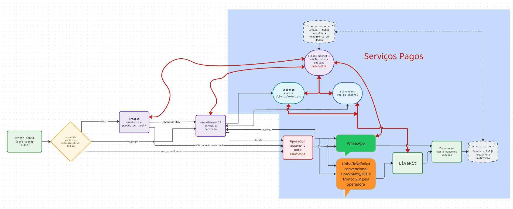
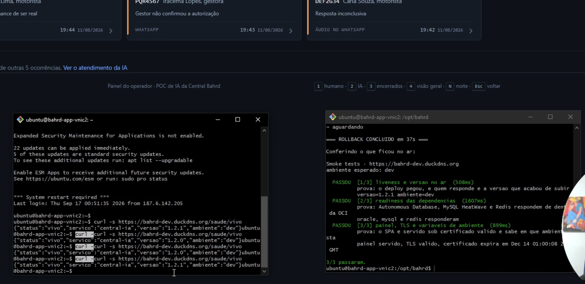

# Bahrd · atendimento de eventos de frota com IA

Quando um veículo monitorado dispara um alerta, alguém precisa descobrir se é
problema de verdade. Hoje esse alguém é uma pessoa, lendo e digitando. Este
sistema atende no lugar dela o que consegue confirmar sozinho — e chama a
pessoa quando o caso exige julgamento, autoridade ou tem risco.

> ### ⚠️ Projeto acadêmico · empresa e dados fictícios
>
> A **Bahrd Monitoramento** não existe. É uma empresa fictícia criada para a
> disciplina *AI Factory: Build, Deploy and Showcase* (PUCPR), assim como a
> **Vetor**, fornecedora da URA legada citada na documentação.
>
> **Todo dado neste repositório é sintético e inventado** — telefones, placas,
> nomes, endereços, coordenadas, IMEIs e identificadores de conta. Nenhum
> corresponde a pessoa, veículo, empresa ou conta real, e nada aqui provém de
> cliente, operação ou sistema de terceiro.



A cor diz o papel de cada peça. **A área azul é o que tem custo por uso**, e o
tracejado é o que ainda não está no ar.

Três coisas que o desenho decide:

**O motor de políticas roda antes de qualquer IA.** Ele é determinístico, e é
ele que manda o caso para a triagem, para o atendimento ou direto para uma
pessoa. Nenhum modelo participa dessa escolha.

**A triagem existe só para evento crítico**, e a régua é 90%: acima disso o caso
é de gente, sem conversa. Abaixo, a IA atende.

**O banco está tracejado porque ainda não foi ligado.** A ocorrência vive em
memória, e reiniciar a API apaga as conversas em curso — é a diferença entre
demonstração e sistema.

---

## Entregáveis da Etapa 1

| Pedido | Onde está |
|---|---|
| Auditoria do protótipo — lacunas encontradas antes de mexer | [docs/auditoria-prototipo.md](docs/auditoria-prototipo.md) |
| Matriz de decisão de stack — critérios, pesos e notas | [docs/decisao-stack.md](docs/decisao-stack.md) |
| ADR-001 (MADR) — escolha de stack, alternativas descartadas e o porquê | [docs/adr/0001-stack.md](docs/adr/0001-stack.md) |
| ADR-002 (MADR) — onde o projeto é publicado | [docs/adr/0002-plataforma-de-publicacao.md](docs/adr/0002-plataforma-de-publicacao.md) |
| Diagrama C4 — nível 1 (contexto) e nível 2 (containers) | [nível 1](docs/architecture/c4-nivel-1-contexto.md) · [nível 2](docs/architecture/c4-nivel-2-containers.md) |
| Ambientes de dev e produção separados, com secrets diferentes em cada um | Seção **URL pública**, logo abaixo — máquina, banco e credencial próprios em cada um |
| Rollback testado, com evidência de execução | Seção **Rollback**, logo abaixo — print e log, 33-37s, 3/3 smoke tests depois |
| Post-mortem leve, um incidente, uma página, sem apontar culpados | [Post-mortem 03](docs/post-mortem-03-dependencia-sem-teto.md) — os dois mais longos, com vários incidentes cada, estão na seção **Documentação**, logo abaixo |

---

## O problema

A Bahrd Monitoramento acompanha frotas de veículos. Quando um evento dispara —
bateria removida, movimento sem ignição, botão de pânico — o cliente recebe uma
notificação por WhatsApp. A regra atual é simples e cara:

```
notificação enviada
  ├─ cliente NÃO responde  →  evento fecha, zero trabalho humano
  └─ cliente RESPONDE      →  SEMPRE cai para um operador
```

Não há filtro de complexidade. Qualquer resposta vira toque humano, mesmo
*"tá em manutenção"*. São cerca de **43 mil eventos por mês**, dos quais
**10 mil viram tratativa manual** — e a maior parte dessas não é conversa
difícil: é o operador lendo o retorno do cliente e digitando na placa do
veículo.

**O trabalho que sobra é digitação, não conversa.** É exatamente o que este
sistema faz de ponta a ponta.

## A solução

O evento entra, o motor de políticas decide o caminho, e a IA conversa pelo
canal que o cliente já usa — texto ou áudio de WhatsApp. Ela confirma a causa,
registra o desfecho e encerra. Quando não consegue, para e passa o caso adiante
com o histórico inteiro.

O que a torna utilizável sem alguém olhando por cima:

| | |
|---|---|
| **Desfecho fechado** | A IA só conclui o que a política daquele evento autoriza. Não existe desfecho livre. |
| **Blindagem de saída** | Toda resposta passa por um filtro antes de sair: sem link, sem exceder o teto de caracteres, sem repassar instrução de sistema. |
| **Trilha de auditoria** | Política aplicada, versão do prompt, evidência da triagem e custo ficam registrados por ocorrência. |
| **Escalonamento explícito** | Pânico, coação e pedido de humano param a IA. Não é sugestão do modelo: é regra do domínio. |

## URL pública

### **https://bahrd.duckdns.org**

O painel do operador abre direto; a API responde no mesmo domínio.

| | |
|---|---|
| **Produção** | [bahrd.duckdns.org](https://bahrd.duckdns.org) · versão `1.0.0` |
| **Desenvolvimento** | [bahrd-dev.duckdns.org](https://bahrd-dev.duckdns.org) · secrets próprios |
| **Onde roda** | Oracle Cloud, São Paulo, camada gratuita permanente ([ADR-002](docs/adr/0002-plataforma-de-publicacao.md)) |
| **TLS** | Let's Encrypt, emitido e renovado pelo Caddy |

### Separação de ambientes

Não é só domínio diferente — cada camada tem sua própria credencial, e nenhuma
é compartilhada entre dev e produção:

| Camada | Produção | Desenvolvimento |
|---|---|---|
| Máquina | VM própria, IP próprio | VM própria, IP próprio |
| Deploy (SSH, token do painel) | [GitHub Environment](https://github.com/Leonardolabdc/bahrd-ia/settings/environments) `prod` | [GitHub Environment](https://github.com/Leonardolabdc/bahrd-ia/settings/environments) `dev` — secrets isolados, um não enxerga o outro |
| Oracle Autonomous Database | usuário `CENTRAL_IA`, schema próprio | usuário `CENTRAL_IA_DEV`, schema próprio (tabelas independentes, mesmas migrações) |
| MySQL HeatWave | usuário `bahrd`, schema `central_ia` | usuário `central_ia_dev`, schema `central_ia_dev` — sem permissão sobre o schema de produção |

Cada usuário de banco tem senha própria, nunca reaproveitada entre os dois
ambientes. Um bug em desenvolvimento não tem como escrever num dado de
produção — a credencial que a aplicação usa em dev simplesmente **não tem
acesso** às tabelas de produção, no nível do próprio banco, não só por
convenção de código.

> ⚠️ **Lacuna conhecida:** produção ainda conecta ao MySQL com `bahrd`, a
> conta administrativa da instância (a mesma usada para criar o usuário de
> dev), em vez de uma conta de aplicação com privilégio restrito só ao seu
> schema. Funciona e está isolado de dev, mas não segue o princípio de menor
> privilégio — fica registrado para a próxima iteração, mesmo padrão do
> Oracle (`CENTRAL_IA`, sem privilégio de DBA).

Sondas abertas, sem autenticação:

```bash
curl https://bahrd.duckdns.org/saude/vivo     # o processo e a versão no ar
curl https://bahrd.duckdns.org/saude/pronto   # Oracle, MySQL e Redis
```

E os três [smoke tests](tests/smoke/smoke.sh), que é como se confere de fora:

```bash
VERSAO_ESPERADA=1.0.0 ./tests/smoke/smoke.sh https://bahrd.duckdns.org
```

### Rollback

Uma VM não tem rollback de plataforma — não existe nada guardado além do que
[infra/deploy/rollback.sh](infra/deploy/rollback.sh) guarda. Testado ao vivo:
janela da esquerda mostra a versão caindo de `1.2.1` para `1.2.0` e voltando,
pedida de fora por `curl`; janela da direita é o script rodando, terminando em
37s com os três smoke tests passando sozinho no fim.



Log de outra execução, 33s: [docs/evidencias/rollback-2026-09-15.log](docs/evidencias/rollback-2026-09-15.log).

> **O painel está aberto a quem tiver o endereço.** Não é descuido: é a
> [lacuna 12 da auditoria](docs/auditoria-prototipo.md), aceita enquanto todo
> dado é sintético e há um operador só. O segredo que protege `/painel/*` é
> injetado pelo Caddy no caminho servidor-a-servidor e **nunca chega ao
> navegador** — o que se garante aqui é não vazar credencial, não controle de
> acesso. Autenticação de operador é item de fila, com gatilho declarado.

## Como rodar

Só precisa de **Docker**. Nada é instalado na máquina: Python, bancos, fila e
painel sobem em contêiner.

```bash
make setup     # cria o .env a partir do .env.example
make up        # sobe a pilha
make test      # 953 testes, sem tocar rede nem API paga
```

No Windows, o mesmo pelo PowerShell: `.\dev.ps1 setup`, `.\dev.ps1 up`,
`.\dev.ps1 test`.

Depois do `make up`:

| Onde | O quê |
|---|---|
| http://localhost:5173 | painel do operador |
| http://localhost:8000/docs | a API, com o OpenAPI navegável |
| http://localhost:16686 | Jaeger, os rastros de cada atendimento |

**Uma variável precisa de valor de verdade** antes de a IA falar:
`OPENROUTER_API_KEY` no `.env`. Sem ela a pilha sobe, os testes passam e a
conversa não acontece. O resto do `.env.example` já vem com valor de
desenvolvimento.

E antes do primeiro commit, uma vez:

```bash
git config core.hooksPath .githooks
```

É a trava que impede segredo e dado pessoal de entrarem por descuido. Ela é
local e **não vem no clone**, então cada pessoa liga a sua.

Detalhes de cada serviço e problemas conhecidos estão em
[04 · Ambiente Docker](docs/04-ambiente-docker.md).

## Arquitetura

| Camada | O que roda |
|---|---|
| **Back-end** | Python 3.12 · FastAPI · Pydantic v2 · arq |
| **Front-end** | React 19 · TypeScript · Vite · CSS com design tokens |
| **Modelo** | Claude Sonnet 5 via OpenRouter, com cache de prompt |
| **WhatsApp** | Twilio (sandbox) · adaptador para Cloud API da Meta disponível |
| **STT / TTS** | Deepgram Nova-3 · ElevenLabs Flash v2.5 |
| **Banco de registro** | Oracle 26ai (Blockchain Table) — Autonomous Database na OCI |
| **Banco operacional** | MySQL 8.4 em dev · MySQL HeatWave 26.7 na OCI |
| **Barramento / cache** | Redis 7 |
| **Observabilidade** | OpenTelemetry → Jaeger em dev · logs estruturados em produção |
| **Infraestrutura** | Docker Compose · 2× VM.Standard.E2.1.Micro (x86) na OCI |

```
bahrd-ia/
├── src/central_ia/        o código da aplicação
├── web/                   painel do operador (React + Vite)
├── tests/                 953 testes
├── prompts/               os textos que definem como a IA fala
├── docs/                  arquitetura, custo e segurança
├── docker/                imagens e composição dos contêineres
├── infra/                 configuração de servidor e nuvem
├── migrations/            evolução do banco (Alembic)
└── .githooks/             trava de segredo, ativada com core.hooksPath
```

Dentro de `src/central_ia/`:

| Pasta | O que faz |
|---|---|
| **`domain/`** | as regras — catálogo de eventos, limiares, desfechos permitidos |
| **`agent/`** | a IA conversando — turno, triagem, blindagem, esforço |
| **`api/`** | rotas HTTP — webhooks, painel, saúde, mídia |
| **`integrations/`** | adaptadores — Meta, Twilio, OpenRouter, Anthropic, Deepgram |
| **`orchestration/`** | o pipeline: evento → política → IA → desfecho |
| **`ports/`** | os contratos — o que um LLM ou um canal precisa saber fazer |
| **`persistence/`** | banco de dados |
| **`workers/`** | tarefas em segundo plano — esperas e retomadas |
| **`observability/`** | logs estruturados e rastros |

**A regra que sustenta o desenho:** `domain/` não conhece ninguém. Ele define as
regras; `integrations/` implementa os contratos de `ports/`. É por isso que
trocar Twilio por Meta, ou um modelo por outro, foi variável de ambiente — não
reescrita.

## Qualidade

| | |
|---|---|
| **953 testes** | Sem tocar rede, banco nem API paga. Toda dependência externa tem dublê. |
| **Lint** | `ruff` sobre `src`, `migrations` e `tests`. |
| **Varredura de segredo** | `gitleaks` sobre o **histórico**, não só o último commit. |
| **CI** | Os três acima rodam em todo push e pull request. |

A suíte foi construída contra conversas escritas como um motorista escreve —
com erro de digitação, caixa alta, gíria, mensagem picada, cliente irritado e
tentativa de injeção de prompt.

## Documentação

| Documento | Conteúdo |
|---|---|
| **[02 · Plano de execução](docs/02-plano-execucao-backend.md)** | Decisões de arquitetura e a justificativa de cada uma, estratégia Docker-first, modelo de dados, guardrails, front-end e roadmap |
| **[04 · Ambiente Docker](docs/04-ambiente-docker.md)** | Como subir a pilha local, as decisões não óbvias (sondas de saúde, migrações) e os problemas conhecidos |
| **[05 · Deploy](docs/05-deploy-oci.md)** | Publicação da imagem, variáveis por ambiente, sequência de deploy e rollback |
| **[06 · Custo mensal](docs/06-custo-mensal.md)** | Projeção por serviço, com o grau de confiança de cada linha |
| **[07 · Segurança](docs/07-seguranca.md)** | O que já está protegido, o que fica para depois com o gatilho de cada item, e o que decidimos **não** fazer |
| **[08 · Runbook de deploy](docs/08-runbook-deploy.md)** | Do zero ao ar: DNS, firewall, wallet, primeiro deploy, CD e ensaio de rollback |
| **[Auditoria do protótipo](docs/auditoria-prototipo.md)** | As 14 lacunas encontradas antes de mexer, com o comando que revelou cada uma |
| **[Matriz de decisão](docs/decisao-stack.md)** | Critérios, pesos e notas — os pesos fixados um dia antes das notas |
| **[ADR-001](docs/adr/0001-stack.md)** · **[ADR-002](docs/adr/0002-plataforma-de-publicacao.md)** | Manter a stack herdada · publicar na Oracle Cloud |
| **[C4 · nível 1](docs/architecture/c4-nivel-1-contexto.md)** · **[nível 2](docs/architecture/c4-nivel-2-containers.md)** | Contexto e contêineres |
| **[Post-mortem 01](docs/post-mortem-01-pii-no-historico.md)** | Dado pessoal no histórico do Git: causa raiz e o que mudou |
| **[Post-mortem 02](docs/post-mortem-02-primeiro-deploy.md)** | O primeiro deploy e os dez defeitos que ele revelou — todos invisíveis em desenvolvimento |
| **[Post-mortem 03](docs/post-mortem-03-dependencia-sem-teto.md)** | Leve, uma página — dependência sem teto de versão quebrou o MySQL sozinha, sem nenhum código tocado |
| **[CHANGELOG](CHANGELOG.md)** | O que mudou em cada versão |

## Configuração que muda por ambiente

Nenhuma é código, e todas são fáceis de esquecer justo no dia em que mais
importam.

| Variável | Efeito |
|---|---|
| `BAHRD_WEBHOOK_HMAC_SECRET` | Sem um segredo real, qualquer um forja um evento. |
| `ESCALONAMENTO_HUMANO_ATIVO` | Com `false`, a IA encerra tudo registrando o motivo pelo qual teria escalado. |
| `PANICO_AUTONOMO` | Permite à IA encerrar sozinha um pânico que ela classificou como alarme falso. |
| `LANGFUSE_ENVIAR_CONTEUDO` | Com `true`, conteúdo de conversa sai para a nuvem de observabilidade. |

O valor de desenvolvimento do HMAC se chama `dev-hmac-nao-usar-em-producao`
justamente para não passar despercebido numa revisão.

## Estado

**Funciona ponta a ponta, com evento sintético e celular de verdade:**

```
evento → template com mapa → botões → conversa → desfecho → painel
```

**O que ainda não existe:**

| | |
|---|---|
| Assinatura HMAC do webhook | desligada desde o protótipo herdado ([lacuna 4](docs/auditoria-prototipo.md)) |
| Voz por telefone | sem provedor definido |

---

## Sobre este repositório

Projeto acadêmico da disciplina **AI Factory: Build, Deploy and Showcase**
(PUCPR).

**A Bahrd Monitoramento é uma empresa fictícia**, assim como a Vetor,
fornecedora da URA legada citada na documentação. Os volumes, playbooks e
decisões de negócio descritos aqui compõem um cenário construído para o
trabalho — não descrevem nenhuma operação real.

**Todo dado neste repositório é fictício**, e isso vale para cada categoria:

| | |
|---|---|
| Telefones | dígitos repetidos (`+55 41 99999-8888`) |
| Placas | padrão de exemplo (`ABC1D23`, `XYZ4E56`) |
| Nomes | genéricos, sem correspondência com pessoas |
| Endereços e coordenadas | logradouros inventados |
| IMEIs de rastreador | sequência sintética (`8602000000000xx`) |
| Identificadores de conta | sequência sintética, não resolvem em lugar nenhum |

Isso não depende de disciplina: o teste
**`test_nada_de_dado_real_no_repositorio`** falha a suíte inteira se um dado
que pareça real entrar, e o `gitleaks` varre o histórico em todo push.

Licença em [LICENSE](LICENSE) · como contribuir em
[CONTRIBUTING.md](CONTRIBUTING.md) · política de segurança em
[SECURITY.md](SECURITY.md).

