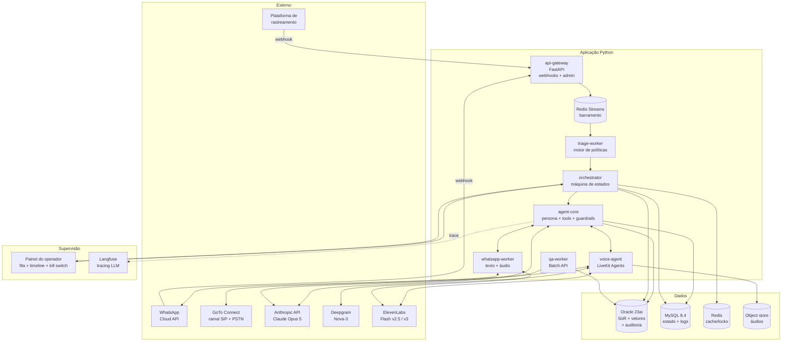
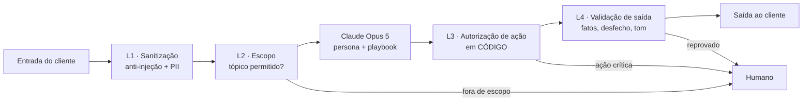

# POC IA — Central de Monitoramento Bahrd · Plano de Execução do Back-end

> **Complemento de** `a documentação interna do projeto`
> **Versão:** 1.1 · **Data:** 11/08/2026 · **Status:** proposta para aprovação
> **Stack obrigatória do cliente:** Python (back-end) · Oracle · MySQL · **tudo em Oracle Cloud (OCI)**

---

## 0. Decisões confirmadas (registro de arquitetura)

| # | Decisão | Definido por | Consequência no plano |
|---|---|---|---|
| **D1** | **Origem dos eventos: sistema próprio da Bahrd.** A plataforma de rastreamento é desenvolvida internamente. | Cliente | O adapter de ingestão é feito **em conjunto com o time de desenvolvimento da Bahrd**, que expõe um webhook de saída sob medida. É o melhor cenário possível: sem dependência de fornecedor, formato negociável, e podemos incluir os campos que a triagem precisa. Fallback: CDC/*polling* incremental no banco. |
| **D2** | **Telefonia: GoTo Connect** (PBX em nuvem já usado pela Bahrd para linha telefônica convencional). | Cliente | **Revisado.** Elimina o prazo regulatório de DID novo **e elimina a necessidade de VPN Site-to-Site** — o GoTo é nuvem, não PABX on-premise. Em troca, cria uma dependência de configuração e de suporte do GoTo. Três modelos de integração viáveis, com recomendação, em **3.3**. |
| **D6** | **Front-end: React.** | Cliente | O painel do operador é uma aplicação React + TypeScript. Stack, telas e princípios de design em **seção 12**. |
| **D7** | **Construir tudo em Docker primeiro; deploy na OCI depois.** | Cliente | ✅ **Decisão acertada.** Destrava o desenvolvimento imediatamente (não depende de provisionamento de nuvem), custo zero durante a construção, e ciclo de teste em segundos. A OCI passa a ser **destino de deploy**, não pré-requisito. Estratégia, matriz de paridade e as 3 armadilhas a evitar em **3.4**. |
| **D3** | **WhatsApp: API Oficial (Cloud API da Meta).** | Cliente | Confirmado o que já era o plano. Continua sendo o item de prazo mais longo (verificação de negócio + número dedicado + templates). |
| **D4** | **Oracle: Autonomous Database Serverless 23ai, instância nova e dedicada à POC.** | **Decisão técnica minha** (o cliente delegou) | Justificativa em 2.6.1. Zero esforço de DBA, 23ai/26ai garantido (VECTOR e Blockchain Table disponíveis), *wallet* mTLS, backup automático, escala sob demanda, e nível *Always Free* utilizável em desenvolvimento. |
| **D5** | **Infraestrutura: 100% Oracle Cloud (OCI)**, região brasileira (`sa-saopaulo-1` ou `sa-vinhedo-1`). | Cliente | Toda a camada de dados fica no Brasil. Os provedores de IA (LLM, STT, TTS) ficam fora do país — isso é **transferência internacional** e entra no DPIA, e **impacta o orçamento de latência de voz** (ver seção 7, revisada). |

**Decisão derivada (minha):** com a infra em OCI, adotamos os serviços gerenciados equivalentes em vez de instalar componentes em VM — **MySQL HeatWave Database Service** no lugar de MySQL em VM, e **OCI Cache (Redis)** no lugar de Redis autogerenciado. Menos operação, mesma semântica, e ambos estão disponíveis nas regiões brasileiras. Mapeamento completo em 3.2.

---

## 1. Resumo executivo das decisões de stack

| Camada | Escolha | Alternativa avaliada | Por quê (resumo) |
|---|---|---|---|
| **Linguagem / API** | **Python 3.12 + FastAPI + Pydantic v2** | Django, Flask | Async nativo, ecossistema de IA/voz é Python-first, validação de schema = base para *structured outputs* |
| **Cérebro (LLM)** | **Claude Opus 5** (`claude-opus-5`) | Sonnet 5, Haiku 4.5 | Melhor raciocínio agêntico e *tool use* do mercado; contexto 1M; *thinking* adaptativo; `effort` regulável por canal (latência); *prompt caching* de 512 tokens |
| **Voz em tempo real** | **LiveKit Agents (Python) + LiveKit SIP** | Pipecat, Vapi, Retell | Infra WebRTC + SDK de agentes maduro, self-hostável (LGPD), *turn detection* semântico próprio, bridge SIP nativo; Pipecat é a alternativa se precisarmos de controle fino de pipeline |
| **STT (voz → texto)** | **Deepgram Nova-3** (streaming) | ElevenLabs Scribe v2, AssemblyAI, Whisper | Melhor WER medido em pt-BR de fala espontânea/sotaque em benchmark independente (6,2% vs 12,1% do concorrente mais próximo) + menor latência de streaming |
| **TTS (texto → voz)** | **ElevenLabs Flash v2.5** (ligação) + **v3** (áudio WhatsApp) | Cartesia Sonic 3.5, MiniMax | TTFA mediano ~210 ms (Flash v2.5) com pt-BR em tier de qualidade alta + clonagem de voz de marca; Cartesia fica como A/B de latência |
| **WhatsApp** | **Meta WhatsApp Cloud API direto** (Graph API) — *confirmado (D3)* | BSP (Zenvia, Infobip, Twilio) | Sem lock-in nem markup na POC; mensagens *não-template* dentro da janela de 24 h são gratuitas; migração para BSP é trivial depois |
| **Telefonia** | **GoTo Connect** — registro do LiveKit SIP como ramal — *confirmado (D2)* | Trunk paralelo Twilio/Telnyx; WebRTC via API do GoTo | Reaproveita o número que os clientes já conhecem, transferência para o operador acontece dentro do próprio GoTo, sem VPN. Ver 3.3 |
| **Front-end** | **React 19 + TypeScript + Vite + Tailwind + shadcn/ui** — *confirmado (D6)* | Next.js, Angular, Vue | SPA atrás do Load Balancer; não precisa de SSR (painel interno, autenticado). Ver seção 12 |
| **Banco de registro (SoR)** | **Oracle Autonomous Database Serverless 23ai** na OCI — *decidido (D4)* | Oracle em VM/Exadata, Base Database Service | Ocorrências, cadastro, contratos, **auditoria imutável (Blockchain Table)** e **AI Vector Search** para o RAG dos POPs — elimina banco vetorial separado, sem esforço de DBA |
| **Banco operacional (hot)** | **MySQL HeatWave Database Service** (OCI) | MySQL em VM | Estado de conversa, transcrições, log de mensagens, métricas — alto volume de escrita, gerenciado, disponível nas regiões brasileiras |
| **Barramento de eventos** | **OCI Cache (Redis 7) + Redis Streams** | OCI Streaming (Kafka), RabbitMQ | Gerenciado, com *consumer groups*, ACK e DLQ; OCI Streaming na fase 2 se o volume exigir |
| **Workers assíncronos** | **arq** (async nativo) | Celery, Dramatiq, Temporal | Roda no mesmo loop asyncio; Temporal entra na fase 2 se precisarmos de *sagas* duráveis complexas |
| **Embeddings (RAG)** | **Modelo ONNX multilíngue carregado no Oracle** (`DBMS_VECTOR.UTL_TO_EMBEDDING`) | Cohere embed-v4, OpenAI | Dado nunca sai do banco → argumento forte de LGPD; zero latência de rede; Cohere como fallback se a qualidade em pt-BR não bastar |
| **Guardrails** | **Camadas próprias** + **Presidio** (PII pt-BR) + **NeMo Guardrails** (opcional, rails tópicos) | Guardrails AI, LLM Guard | Regras críticas em código (não em prompt); NeMo adiciona 100–300 ms — só entra nos canais assíncronos |
| **Observabilidade LLM** | **Langfuse self-hosted** + OpenTelemetry | Arize Phoenix, LangSmith | Self-hosted (dado sensível não sai), *tracing* por ocorrência, custo por conversa |
| **Avaliação** | Harness próprio + **Anthropic Batch API** (50% off) para LLM-as-judge | promptfoo, Coval, Hamming | Cenários gravados de voz + rubrica de QA; Batch API derruba o custo do juiz |
| **Infra POC** | **OCI, região brasileira** — *confirmado (D5)*: OKE ou Compute + serviços gerenciados | On-premise, AWS/Azure | Docker Compose só no ambiente local do desenvolvedor; mapeamento de serviços em 3.2 |

---

## 2. Justificativa detalhada das escolhas de IA

### 2.1 Por que Claude Opus 5 como cérebro

O agente precisa, na mesma conversa: interpretar telemetria, seguir um POP com passos condicionais, chamar 6–10 ferramentas na ordem certa, respeitar guardrails, e decidir escalar. Isso é trabalho **agêntico com *tool use* encadeado** — não geração de texto. Opus 5 é o topo dessa categoria hoje, com três características que importam diretamente aqui:

1. **`effort` regulável (`low` → `max`)** — permite usar o *mesmo modelo e o mesmo prompt* com custo/latência diferentes por canal: `low`/`medium` no loop de voz (onde 300 ms importam), `high`/`xhigh` na triagem e no QA assíncrono. Opus 5 tem desempenho forte em `low`/`medium`, o que é exatamente o que o loop de voz precisa.
2. **Prompt caching com mínimo de 512 tokens** — persona + playbooks + esquema de ferramentas ficam em cache (TTL 1 h), o que corta TTFT e ~90% do custo de entrada. Isso é decisivo para latência de voz.
3. **Mensagens de sistema no meio da conversa** (`{"role": "system"}` dentro de `messages`) — permite injetar **atualização de telemetria em tempo real durante a ligação** ("o veículo voltou a se movimentar às 19:42") sem reescrever o *system prompt* e **sem invalidar o cache**. Para uma central de monitoramento, onde o mundo muda durante a chamada, isso é uma vantagem arquitetural concreta.

Além disso: contexto de 1M (histórico longo do cliente cabe), *structured outputs* com validação estrita (decisões da IA chegam como objeto Pydantic validado, não como texto a parsear), e *compaction* para conversas longas.

**Configuração recomendada por caminho:**

| Caminho | Modelo | `thinking` | `effort` | Observação |
|---|---|---|---|---|
| Triagem / seleção de playbook | `claude-opus-5` | `adaptive` | `high` | Assíncrono, precisão importa mais que latência |
| Turno de conversa — **ligação** | `claude-opus-5` | `adaptive` | `low` | Medir p95; ver 2.2 se não fechar o orçamento |
| Turno de conversa — WhatsApp | `claude-opus-5` | `adaptive` | `medium` | Tolerante a latência |
| Briefing de handoff | `claude-opus-5` | `adaptive` | `medium` | *Structured output* |
| QA pós-atendimento (juiz) | `claude-opus-5` | `adaptive` | `xhigh` | Via **Batch API** (50% de desconto) |

> ⚠️ **Não desabilitar o *thinking*** no Opus 5 para ganhar latência. Com `thinking: {"type": "disabled"}` o modelo ocasionalmente escreve a chamada de ferramenta **como texto visível** — o turno "dá certo", a ferramenta nunca executa, e nenhum erro é levantado. Em um agente de central de monitoramento isso é uma falha silenciosa inaceitável. O caminho correto para latência é **`effort: low` com thinking ligado**.

### 2.2 Plano B de latência (se o p95 de voz não fechar em 1.200 ms)

Nesta ordem, medindo a cada passo:

1. Reduzir para `effort: "low"` e enxugar o *system prompt* (mover POP detalhado para RAG sob demanda).
2. Ativar o **advisor tool** (beta): executor `claude-sonnet-5` responde os turnos rápidos e **consulta `claude-opus-5`** só nas decisões difíceis dentro da mesma chamada. Mantém a qualidade nas decisões e derruba a latência do turno comum.
3. Só então avaliar `claude-sonnet-5` puro no loop de voz, mantendo Opus 5 na triagem, no handoff e no QA. **Essa é uma decisão do cliente, não minha** — troca de modelo é troca de qualidade, e a POC deve medir antes de decidir.

### 2.3 Por que Deepgram Nova-3 para STT

Benchmark independente sobre fala espontânea com sotaque em português brasileiro (CommonVoice-PT) coloca Nova-3 em **6,2% de WER**, cerca de 2× melhor que o concorrente nativo mais próximo (12,1%) — e Deepgram lidera latência de streaming, que é o que decide *turn-taking*. Como o interlocutor típico é motorista, em cabine, com ruído de estrada e celular em viva-voz, robustez a sotaque e ruído vale mais que WER de laboratório.

**Ação obrigatória da POC:** rodar o benchmark com **áudio real da Bahrd** (100 gravações reais anonimizadas) contra Nova-3, ElevenLabs Scribe v2 e AssemblyAI antes de fechar. Números públicos são ponto de partida, não decisão.

### 2.4 Por que ElevenLabs para TTS

TTFA mediano de ~210 ms no `eleven_flash_v2_5` (medição independente) com português entre os idiomas suportados, e — o diferencial para este projeto — **clonagem de voz** para criar *a* voz da Bahrd, usada de forma idêntica na ligação e na nota de voz do WhatsApp. Consistência de voz entre canais é uma das alavancas mais fortes de percepção de "atendimento de verdade".

Cartesia Sonic 3.5 é mais rápido em algumas medições (~82 ms fim-a-fim reivindicado; ~277 ms de TTFA mediano em benchmark de terceiro) e fica como **A/B obrigatório** na POC com juízes humanos avaliando naturalidade em pt-BR.

### 2.5 Por que LiveKit Agents e não uma plataforma gerenciada

Vapi/Retell são mais rápidos de subir e fazem sentido abaixo de ~10k min/mês. Descartados aqui por três razões específicas da Bahrd:

- **Dado sensível + LGPD:** LiveKit é self-hostável; o áudio do cliente não precisa transitar por uma plataforma de terceiro fora do nosso controle.
- **Integração com a telefonia existente:** o LiveKit SIP conecta em qualquer trunk ou PBX (BYOT) — inclusive registrando-se como ramal no **GoTo Connect** que a Bahrd já usa, o que preserva o número conhecido pelos clientes.
- **Controle do *turn-taking*:** a POC precisa de *end-of-turn* semântico e *barge-in* ajustáveis — VAD acústico puro corta o motorista no meio da frase (o gap natural entre turnos humanos é de ~200 ms, mas o limite de silêncio útil fica em 800–1.200 ms combinado com completude semântica). Precisamos desse dial na nossa mão.

Pipecat (Python, também open source) é a alternativa direta e fica documentada como plano B — a camada de abstração da seção 4 mantém a troca viável.

### 2.6 O papel de Oracle e MySQL (e por que os dois)

Não é redundância — é separação por natureza de dado:

| | **Oracle 23ai/26ai** | **MySQL 8.4** |
|---|---|---|
| Natureza | Sistema de registro, regulado, auditável | Camada operacional quente |
| Conteúdo | Ocorrências, clientes, veículos, contratos, políticas, consentimentos LGPD, **auditoria imutável**, **base vetorial dos POPs** | Estado de sessão de conversa, log de mensagens, transcrições, jobs, métricas brutas |
| Perfil de acesso | Leitura/escrita transacional, baixa frequência, alta criticidade | Escrita intensa, alta frequência, descartável após retenção |
| Recursos usados | `VECTOR` + `VECTOR_DISTANCE` + índice HNSW; `BLOCKCHAIN TABLE`; TDE; `DBMS_VECTOR.UTL_TO_EMBEDDING` | JSON columns, particionamento por data, TTL por job |

Dois recursos do 23ai que justificam a escolha para este caso de uso específico:

- **AI Vector Search nativo** — o RAG dos POPs e do histórico de ocorrências similares roda **dentro do Oracle**, com pré/in/pós-filtro (ex.: "busque POPs semanticamente próximos **e** aplicáveis a este tipo de contrato"). Não precisamos de Pinecone/Qdrant, e o dado não sai do banco.
- **Blockchain Table** — trilha de auditoria criptograficamente encadeada e imutável, com `NO DELETE LOCKED`. Para uma central de monitoramento que pode ser questionada judicialmente sobre "por que a IA fechou essa ocorrência", isso é um ativo, não um enfeite.

Driver: **`python-oracledb` em modo *thin* com API asyncio** (`oracledb.create_pool_async()`), sem necessidade de Oracle Client instalado. Para o MySQL: **SQLAlchemy 2.0 async + `asyncmy`** e Alembic para migrações.

### 2.6.1 Por que Autonomous Database Serverless, e não Oracle em VM (decisão D4)

O cliente delegou esta escolha. Optei por **Autonomous Database Serverless (ADB-S) 23ai, instância nova e dedicada à POC**, por cinco razões:

1. **A versão deixa de ser um risco.** A POC depende de `VECTOR` e `BLOCKCHAIN TABLE`, que só existem no 23ai/26ai. Um Oracle 19c legado inviabilizaria metade do valor arquitetural do projeto. No ADB-S a versão vem correta por padrão, e o *upgrade* é da Oracle.
2. **Zero esforço de DBA.** *Patching*, backup, *tuning* de memória e alta disponibilidade são do serviço. Numa POC de 6 semanas, cada dia de DBA gasto em infraestrutura é um dia não gasto no produto.
3. **`vector_memory_size` já resolvido.** Em Oracle autogerenciado, o índice vetorial `INMEMORY NEIGHBOR GRAPH` exige alterar parâmetro e reiniciar a instância — janela de manutenção negociada com o DBA. No ADB-S isso é gerenciado.
4. **Isolamento total do legado.** A POC não escreve, não trava e não consome recurso do banco de produção do sistema da Bahrd. O acesso ao legado é só de leitura, por *views* ou *database link*, e é reversível.
5. **Custo controlado e reversível.** ECPU e armazenamento com escala automática, possibilidade de parar a instância fora do horário de testes, e nível *Always Free* utilizável no ambiente de desenvolvimento.

**Ponto de atenção honesto:** ADB-S impõe algumas restrições que o Oracle autogerenciado não tem (privilégios administrativos limitados, conexão obrigatoriamente por *wallet*/mTLS, e recursos como `UTL_FILE` restritos). Nada disso afeta o que a POC faz — todas as operações são DDL/DML no próprio schema, `DBMS_VECTOR` e Blockchain Table, todos suportados. Se em algum ponto surgir uma necessidade administrativa fora do envelope do ADB-S, o caminho de saída é migrar para **Base Database Service** na mesma OCI, sem mudança de código (mesmo driver, mesmo SQL).

**Conexão:** o `python-oracledb` em modo *thin* conecta no ADB-S usando o *wallet* (arquivo `.zip` baixado do console) ou apenas o `tnsnames`/TLS, sem Oracle Client instalado. O *wallet* fica no **OCI Vault**, nunca no repositório.

---

## 3. Arquitetura de componentes



### 3.1 Responsabilidade de cada serviço

| Serviço | Responsabilidade | Não faz |
|---|---|---|
| `api-gateway` | Recebe webhooks (rastreamento, WhatsApp), valida assinatura, deduplica, publica no barramento; expõe API do painel | Nenhuma regra de negócio |
| `triage-worker` | Enriquece o evento e aplica o **motor de políticas** (determinístico); decide elegibilidade e canal base | Não chama LLM para decidir elegibilidade |
| `orchestrator` | Máquina de estados da ocorrência, SLA/timers, cascata de canais, handoff, auditoria | Não conversa |
| `agent-core` | Monta o prompt, executa o *tool runner*, aplica guardrails de entrada/saída, registra trace | Não conhece transporte |
| `voice-agent` | Sessão LiveKit: SIP ↔ STT ↔ agent-core ↔ TTS, *barge-in*, *fillers*, gravação | Não decide política |
| `whatsapp-worker` | Envio/recebimento de texto e nota de voz, templates, janela de 24 h | Não decide política |
| `qa-worker` | Avalia 100% das ocorrências fechadas pela IA com rubrica (Batch API), abre alerta em desvio | Não altera desfecho automaticamente |

### 3.2 Mapeamento para serviços gerenciados da OCI — **destino do deploy** (D7)

> ℹ️ Esta seção descreve **onde a POC vai rodar em produção**, não onde ela é construída. Pela decisão D7, o desenvolvimento acontece em Docker (seção 3.4) e o provisionamento da OCI abaixo é executado a partir do Sprint 3/4, em paralelo, sem bloquear ninguém.

Região: **`sa-saopaulo-1` (São Paulo)** ou **`sa-vinhedo-1` (Vinhedo)** — a escolha final sai da medição de latência (seção 7.4).

| Componente | Serviço OCI | Dimensionamento POC |
|---|---|---|
| `api-gateway`, `orchestrator`, `triage-worker`, `whatsapp-worker`, `qa-worker` | **OKE** (Container Engine for Kubernetes) — ou 2 VMs Compute se o time preferir simplicidade | 4 OCPU / 16 GB no total |
| `voice-agent` + servidor **LiveKit** + módulo SIP | **Compute VM dedicada** com IP público reservado | 4 OCPU / 16 GB · UDP 50000–60000 aberto |
| Oracle (SoR, vetores, auditoria) | **Autonomous Database Serverless 23ai** | 2 ECPU com auto-scale · 1 TB |
| MySQL (operacional) | **MySQL HeatWave Database Service** (sem cluster HeatWave na POC) | `MySQL.2` (2 OCPU / 32 GB) · 100 GB |
| Redis (barramento + cache) | **OCI Cache (Redis 7)** | 1 nó, 2 GB · AOF ligado no DB do barramento |
| Áudios e mídia | **OCI Object Storage** + regra de *lifecycle* de 90 dias | Bucket privado, criptografia com chave do Vault |
| Segredos e chaves | **OCI Vault** (KMS + Secrets) | Um *compartment* de segredos por ambiente |
| Entrada HTTPS pública (webhooks Meta e sistema Bahrd) | **OCI Load Balancer** + **OCI WAF** | Certificado gerenciado |
| Saída para internet com IP fixo | **NAT Gateway** com IP público reservado | Para informar em *allowlists* de terceiros |
| Acesso privado ao Object Storage | **Service Gateway** | Evita que o áudio saia pela internet |
| Logs, métricas e traces | **OCI Logging + Monitoring + APM** (APM aceita OpenTelemetry) | Langfuse opcional, em VM, na fase 2 |
| Identidade das aplicações | **IAM Dynamic Groups + Instance/Workload Principals** | Elimina chave estática para acessar Vault e Object Storage |
| Controle de custo | **OCI Budgets** com alerta em 50% / 80% / 100% | Obrigatório antes de ligar qualquer coisa |

**Ganho concreto de usar *workload/instance principals*:** os serviços autenticam na OCI pela própria identidade da instância — não existe chave de acesso da OCI em `.env`. Só sobram os segredos de terceiros (Anthropic, Deepgram, ElevenLabs, WhatsApp), e esses ficam no Vault.

### 3.3 Integração com o GoTo Connect (revisado — decorrente de D2)

**Resposta curta: sim, é possível — e é um cenário melhor do que um PABX on-premise.**

O GoTo Connect é um PBX em nuvem (UCaaS). Isso tem duas consequências imediatas e boas:

- ✅ **Não é mais necessária a VPN Site-to-Site OCI ↔ PABX.** O caminho crítico de 5–10 dias de rede desaparece: o agente registra pela internet no serviço do GoTo.
- ✅ **O handoff para o operador humano fica trivial.** Se o agente for um ramal dentro do próprio GoTo, a transferência assistida para o operador é uma transferência interna do PBX — não precisamos costurar dois sistemas de telefonia.

Existem **três modelos** de integração. A escolha depende do que o plano da Bahrd permite e do que o suporte do GoTo confirmar.

#### Modelo 1 — LiveKit SIP registrado como ramal no GoTo Connect ✅ **recomendado**

O GoTo Connect suporta registro de **endpoints SIP de terceiros como ramais** — é o mesmo mecanismo usado por dispositivos de *paging* e telefones BYOD. Os parâmetros documentados são:

| Parâmetro | Valor |
|---|---|
| SIP Domain | `reg.jiveip.net` |
| Outbound Proxy | `<dominio-da-conta>.jive.rtcfront.net` |
| Porta | 5060 |
| Usuário / Auth ID / Senha | **fornecidos pelo suporte do GoTo** após criar o dispositivo no admin |

Fluxo de configuração no admin do GoTo: **Phone System → Direct Extensions** (criar o ramal da IA) → **Devices → + Add device → Standalone Device** (associar ao ramal) → solicitar as credenciais SIP ao suporte.

**Como fica na prática:**

```
Entrada:  motorista liga → DID conhecido da Bahrd → fila/roteamento do GoTo
                                                 → ramal da IA (LiveKit SIP)
Saída:    IA disca → ramal da IA → trunk do GoTo → celular do motorista
                                   (com o BINA/caller ID da Bahrd)
Handoff:  IA envia SIP REFER → ramal do operador humano no GoTo
          (transferência assistida dentro do próprio PBX)
```

**Ganho decisivo:** o motorista vê e liga para **o número que já conhece**. Em rastreamento de carga isso não é detalhe — é o que faz o motorista atender.

**O que precisa ser confirmado com o suporte/gerente de conta do GoTo (item de Sprint 0):**

| # | Pergunta | Por que importa |
|---|---|---|
| 1 | O plano da Bahrd permite **Standalone Device / SIP genérico**? | Se não permitir, o Modelo 1 está fora |
| 2 | O cadastro exige **endereço MAC** — aceitam um MAC virtual para um endpoint de software? | O LiveKit não é um telefone físico |
| 3 | **Quantas chamadas simultâneas** um ramal suporta? Precisamos de ~10 | Um ramal comum costuma suportar 1 chamada |
| 4 | Qual **codec** é oferecido ao endpoint: G.711 (8 kHz) ou Opus (48 kHz)? | Impacta diretamente o WER do STT (ver nota abaixo) |
| 5 | O registro pode vir de um **IP em nuvem (OCI Brasil)**? Há restrição por geografia ou allowlist? | Alguns planos restringem |
| 6 | Suporta **TLS para sinalização e SRTP para mídia**? | Requisito de LGPD para áudio em trânsito pela internet |
| 7 | Onde fica o **media edge (POP) da conta da Bahrd** — Brasil, EUA ou Europa? | Decide onde hospedamos o `voice-agent` (ver 7.4 revisada) |
| 8 | Suporta **SIP REFER** para transferência do ramal da IA para o ramal do operador? | É o mecanismo do handoff assistido |

> **Nota sobre codec — pode ser uma vantagem inesperada.** A API do GoTo negocia mídia por WebRTC com **Opus a 48 kHz**. Se o endpoint SIP também conseguir Opus em banda larga, o áudio chega ao STT com qualidade muito superior ao G.711 de 8 kHz do telefone tradicional. Para caminhoneiro em cabine ruidosa, isso pode valer vários pontos percentuais de WER — vale perguntar (item 4) e testar.

#### Modelo 2 — WebRTC pela Devices and Calls API do GoTo

O GoTo tem uma **Devices and Calls API** que inicia, atende, rejeita e encaminha chamadas, com eventos por *webhook* / WebSocket (Notification Channel API), e a mídia é negociada por **SDP/WebRTC — Opus 48 kHz, DTLS/SRTP, ICE**.

| Vantagem | Desvantagem |
|---|---|
| Melhor qualidade de áudio (Opus 48 kHz) → melhor STT | Sinalização proprietária do GoTo, não SIP padrão — mais engenharia |
| Controle de chamada programático e eventos ricos | Depende de plano com acesso à API e escopos OAuth |
| LiveKit já é WebRTC nativo | Precisa confirmar se a mídia é entregue ao *nosso* peer, e não apenas ao softphone do GoTo |

Avaliar no Sprint 3 **se** o Modelo 1 ficar preso em G.711 e o WER não fechar.

#### Modelo 3 — Trunk paralelo (Twilio/Telnyx) ⚠️ **contingência**

A IA ganha trunk e DID próprios; o GoTo encaminha números ou filas específicas para esse DID, e a IA transfere de volta para um DID/ramal do GoTo no handoff.

| Vantagem | Desvantagem |
|---|---|
| Independência total do GoTo — destrava o Sprint 3 sem depender de aprovação | Um fornecedor e uma fatura a mais |
| Controle fino de SIP, mídia e codec | Caller ID diferente do número conhecido (mitigável por portabilidade) |
| É o plano B natural | Handoff cruza dois sistemas de telefonia |
| Volta o prazo regulatório de DID brasileiro (5–20 dias) | Por isso: **iniciar a consulta ao GoTo no Sprint 0**, para não precisar do plano B às pressas |

#### Recomendação

**Modelo 1 como principal**, com as 8 perguntas do quadro acima levadas ao suporte do GoTo **já no Sprint 0**. Se as respostas 1, 2, 3 ou 5 forem negativas, aciona-se o **Modelo 3** — e nesse caso o pedido de DID precisa entrar imediatamente, porque volta a ser caminho crítico. O **Modelo 2** fica como otimização de qualidade de áudio, não como caminho inicial.

### 3.4 Estratégia de ambientes: Docker primeiro, OCI depois (D7)

**Sim, é melhor construir em Docker antes.** Três razões concretas:

1. **Destrava o início hoje.** Sem D7, o Sprint 0 dependeria de *compartment*, IAM, VCN, ADB-S, MySQL DS e OCI Cache provisionados — dias de espera de outra equipe antes da primeira linha de código. Com Docker, o time começa em horas.
2. **Custo zero na construção.** Oracle Database Free 23ai, MySQL e Redis rodam em container sem gastar nuvem. A conta da OCI só começa quando há algo para hospedar.
3. **Ciclo de feedback em segundos.** Derrubar o banco, recriar o schema, rodar *seeds* e a suíte de testes é um comando. Contra ADB-S seria minutos e coordenação.

A OCI deixa de ser pré-requisito e passa a ser **destino de deploy**. O que o plano faz para que essa migração não doa depois está abaixo.

#### Matriz de paridade — o que roda local e o que muda na OCI

| Componente | Local (Docker) | OCI (destino) | Delta real | Como isolamos |
|---|---|---|---|---|
| Oracle | `container-registry.oracle.com/database/free:latest` (**23ai** — tem `VECTOR` e `BLOCKCHAIN TABLE`) | Autonomous Database Serverless 23ai | Conexão por **wallet/mTLS**, privilégios de DBA limitados, nome de serviço diferente | Toda a conexão vem de env; **nenhum DDL depende de privilégio de DBA**; teste de fumaça contra ADB-S no Sprint 3 |
| MySQL | `mysql:8.4` | MySQL HeatWave Database Service | Endpoint privado, TLS obrigatório | Só env; TLS ligado já em local |
| Redis | `redis:7-alpine` | OCI Cache (Redis 7) | Endpoint privado, *auth token* | Só env |
| Object storage | **MinIO** (API compatível com S3) | OCI Object Storage (**tem API compatível com S3**) | Endpoint e credencial | Cliente S3 único para os dois — **paridade real, não aproximação** |
| Segredos | `.env` local (não versionado) | OCI Vault | Origem do segredo | Interface `SecretProvider` com duas implementações |
| Observabilidade | Coletor OTel local (Jaeger ou Grafana Tempo) | OCI APM | Endpoint e header | OpenTelemetry nos dois — só muda o exportador |
| Load balancer / TLS | Traefik ou nginx no compose | OCI Load Balancer + WAF | Terminação TLS | Aplicação nunca termina TLS |
| Identidade da aplicação | Credencial em env | *Instance principal* / *workload identity* | Como autentica na OCI | `SecretProvider` e cliente de storage resolvem isso |
| **Voz (SIP/WebRTC)** | ⚠️ **não tem paridade** | GoTo Connect ↔ LiveKit em VM com IP público | NAT e portas UDP | Ver armadilha 3 |

#### As 3 armadilhas — e o que fazemos contra cada uma

**Armadilha 1 · "Funcionou no Oracle Free, quebrou no Autonomous."**
Oracle Free em container é permissivo: você é DBA, `ALTER SYSTEM` funciona, tudo é local. ADB-S não. Um DDL escrito com liberdade de DBA descobre isso no fim do projeto, no pior momento.
**Contramedida:** o schema é criado **como o usuário `CENTRAL_IA`, sem privilégios de DBA, já no ambiente local**. Nada de `ALTER SYSTEM`, `CREATE TABLESPACE`, `UTL_FILE` ou pacote restrito. E um **deploy de fumaça no Sprint 3**: provisiona-se apenas o ADB-S, roda-se todas as migrações e a suíte de integração contra ele. Se algo não passar, sobra sprint para corrigir.

**Armadilha 2 · Segredo em arquivo virando hábito.**
Começar com `.env` é prático e vira dívida: alguém escreve `open(".env")` no código, e na OCI não existe `.env`.
**Contramedida:** desde o primeiro commit, o código **nunca lê arquivo de configuração** — só `os.environ`, atrás de um `Settings` do Pydantic. Segredos chegam por uma interface:

```python
class SecretProvider(Protocol):
    async def get(self, nome: str) -> str: ...

class EnvSecretProvider:      # local
    async def get(self, nome): return os.environ[nome.upper().replace("-", "_")]

class OciVaultSecretProvider: # OCI — mesma interface, lê do Vault
    async def get(self, nome): ...
```

Trocar de ambiente é trocar uma linha na composição, não caçar `open()` pelo projeto.

**Armadilha 3 · Voz não funciona bem em Docker local atrás de NAT.**
SIP e WebRTC precisam de IP alcançável e faixa UDP aberta. Em notebook, atrás de NAT doméstico e com o GoTo em nuvem, isso vai falhar de formas confusas e consumir dias de depuração no lugar errado.
**Contramedida — dois modos de voz desde o começo:**

| Modo | Onde | Como funciona | Para quê |
|---|---|---|---|
| `voz_simulada` | Docker local | Injeta um arquivo WAV como se fosse a fala do cliente e grava a resposta do TTS em arquivo. Sem SIP, sem WebRTC | Desenvolver e testar **toda** a lógica de conversa, playbook, ferramentas e guardrails — que é 90% do trabalho |
| `voz_livekit_sip` | VM com IP público (OCI ou qualquer VPS) | Pilha real: GoTo ↔ LiveKit SIP ↔ STT ↔ agente ↔ TTS | Medir latência real, *barge-in*, qualidade de áudio e o handoff por SIP REFER |

O mesmo `agent-core` atende os dois — o transporte é um adaptador. **Não tentamos fazer SIP real em Docker local.**

#### Regras de preparação (valem desde o primeiro commit)

- **Uma imagem, todos os ambientes.** A imagem que roda no notebook é a que roda na OCI. Nada de `if ambiente == "dev"` no Dockerfile.
- **`Dockerfile` multi-stage por serviço**, imagem final *slim*, usuário não-root, `HEALTHCHECK`.
- **Configuração 100% por variável de ambiente.** Nenhum endpoint, host ou credencial em código.
- **Portas e adaptadores** para tudo que muda entre ambientes: `SecretProvider`, `ObjectStorage`, `EventBus`, `Telephony`, `STT`, `TTS`.
- **Log em JSON no stdout**, nunca em arquivo. É o que OCI Logging e `docker logs` esperam.
- ***Graceful shutdown*** com `SIGTERM` tratado — obrigatório para Kubernetes não cortar conversa no meio.
- **Migrações versionadas e idempotentes:** Alembic no MySQL; scripts SQL numerados no Oracle com um *runner* que registra o que já aplicou.
- **Imagens no OCI Container Registry (OCIR) desde o Sprint 1.** Assim o deploy na OCI é `docker pull`, não "vamos descobrir como publicar".
- **Terraform escrito em paralelo** (`infra/terraform/`), aplicado via OCI Resource Manager quando a conta estiver pronta. A infra nasce versionada, não em cliques de console.
- **`docker-compose.yml` é ambiente de desenvolvimento, não de produção.** Não vamos "subir a POC em compose numa VM" e chamar de deploy.

#### Composição do ambiente local

```yaml
# docker-compose.yml — apenas desenvolvimento
services:
  oracle:      # container-registry.oracle.com/database/free:latest  (23ai)
  mysql:       # mysql:8.4
  redis:       # redis:7-alpine
  minio:       # object storage compatível com S3
  otel:        # coletor OpenTelemetry + Jaeger
  api:         # FastAPI — api-gateway
  worker:      # arq — triage, orchestrator, whatsapp, qa
  web:         # Vite dev server (React)
  # voice:     # perfil opcional; SIP real só na VM com IP público
```

`docker compose --profile voz-simulada up` para o dia a dia; a pilha de voz real sobe separada, na VM.

#### Marco de mitigação de risco

| Quando | O que | Por que nesse momento |
|---|---|---|
| **Sprint 1** | Publicar a primeira imagem no OCIR | Descobre problema de registry e credencial cedo, quando é barato |
| **Sprint 3** | **Deploy de fumaça no ADB-S**: só o banco, com todas as migrações e testes de integração | Mata a armadilha 1 com 3 sprints de folga |
| **Sprint 4** | Ambiente `hml` completo na OCI, rodando em paralelo ao local | O piloto assistido do Sprint 5 já acontece na nuvem |
| **Sprint 5** | Piloto assistido em `prd-poc` na OCI | Migração já validada, não é surpresa |

---

## 4. Estrutura do repositório

```
bahrd-ia/
├── docs/
│   ├── a documentação interna do projeto
│   ├── 02-plano-execucao-backend.md
│   ├── 03-checklist-acessos-e-credenciais.md # o que pedir para a TI
│   ├── a documentação interna do projeto          # próxima entrega
│   └── exemplos/                             # PDFs, planilhas e logo de referência
│       └── fluxo-bahrd-ia.pdf
├── prompts/                                  # versionados, carregados em runtime
│   ├── persona_core.md
│   ├── policy_guardrails.md
│   ├── canal_voz.md · canal_wa_texto.md · canal_wa_audio.md
│   ├── playbooks/PB-*.md
│   ├── triagem_classificador.md
│   ├── handoff_briefing.md
│   └── qa_juiz.md
├── src/central_ia/
│   ├── config.py                             # Pydantic Settings
│   ├── domain/                               # entidades + máquina de estados (puro, testável)
│   │   ├── evento.py · ocorrencia.py · desfecho.py · politica.py
│   ├── policy/                               # MOTOR DE POLÍTICAS (determinístico)
│   │   ├── engine.py · rules.py · gates.py
│   ├── agent/
│   │   ├── brain.py                          # cliente Anthropic + tool runner
│   │   ├── prompt_builder.py                 # montagem + cache breakpoints
│   │   ├── tools/                            # uma ferramenta por arquivo
│   │   ├── guardrails/                       # input/output/action
│   │   └── schemas.py                        # Pydantic p/ structured outputs
│   ├── channels/
│   │   ├── voice/                            # LiveKit agent, STT, TTS, turn detection
│   │   ├── whatsapp/                          # cloud api client, templates, media
│   │   └── base.py                            # ABSTRAÇÃO: trocar provedor sem tocar no agente
│   ├── integrations/
│   │   ├── rastreamento/                      # adapters por plataforma
│   │   ├── stt/ · tts/ · telefonia/           # providers plugáveis
│   ├── persistence/
│   │   ├── oracle/                            # python-oracledb async, repos, vetores, auditoria
│   │   └── mysql/                             # SQLAlchemy async, repos, migrações
│   ├── orchestration/
│   │   ├── state_machine.py · sla.py · cascade.py · handoff.py
│   ├── observability/
│   │   ├── tracing.py · metrics.py · redaction.py
│   ├── api/                                   # FastAPI routers
│   └── workers/                               # arq tasks
├── web/                                       # FRONT-END REACT — ver seção 12
│   ├── src/app/ · src/features/ · src/components/ui/ · src/lib/
│   ├── e2e/                                   # Playwright
│   └── vite.config.ts
├── evals/
│   ├── cenarios/                              # casos de teste (JSON + áudio)
│   ├── rubricas/
│   └── run_eval.py
├── migrations/
│   ├── oracle/                                # scripts DDL versionados
│   └── mysql/                                 # alembic
├── infra/
│   └── terraform/                             # OCI via Resource Manager
├── tests/
├── docker-compose.yml                         # oracle-free, mysql, redis, livekit (dev local)
└── pyproject.toml
```

**Princípio:** `domain/` e `policy/` não importam nada de infraestrutura — são testáveis sem banco, sem rede e sem LLM. É onde vivem as regras que não podem falhar.

---

## 5. Modelo de dados

### 5.1 Oracle — sistema de registro

```sql
-- ===== Cadastro (pode ser VIEW sobre a base legada de rastreamento) =====
CREATE TABLE cliente (
  cliente_id        NUMBER GENERATED ALWAYS AS IDENTITY PRIMARY KEY,
  razao_social      VARCHAR2(200) NOT NULL,
  documento         VARCHAR2(20)  NOT NULL,
  atende_com_ia     CHAR(1) DEFAULT 'S' CHECK (atende_com_ia IN ('S','N')),
  canal_preferido   VARCHAR2(20),                -- LIGACAO | AUDIO | TEXTO
  janela_contato    VARCHAR2(40),                -- ex.: 07:00-22:00
  criado_em         TIMESTAMP WITH TIME ZONE DEFAULT SYSTIMESTAMP
);

CREATE TABLE veiculo (
  veiculo_id     NUMBER GENERATED ALWAYS AS IDENTITY PRIMARY KEY,
  cliente_id     NUMBER NOT NULL REFERENCES cliente,
  placa          VARCHAR2(10) NOT NULL UNIQUE,
  modelo         VARCHAR2(100),
  valor_carga_ref NUMBER(14,2),
  rastreador_id  VARCHAR2(50)
);

CREATE TABLE contato (
  contato_id   NUMBER GENERATED ALWAYS AS IDENTITY PRIMARY KEY,
  cliente_id   NUMBER NOT NULL REFERENCES cliente,
  veiculo_id   NUMBER REFERENCES veiculo,
  nome         VARCHAR2(150) NOT NULL,
  papel        VARCHAR2(30) NOT NULL,            -- MOTORISTA | GESTOR | EMERGENCIA
  telefone_e164 VARCHAR2(20) NOT NULL,
  ordem_acionamento NUMBER DEFAULT 1,
  senha_hash        VARCHAR2(128),               -- NUNCA em texto claro
  senha_coacao_hash VARCHAR2(128)                -- fluxo silencioso
);

-- ===== Ocorrência: o objeto central do fluxo =====
CREATE TABLE ocorrencia (
  ocorrencia_id       VARCHAR2(40) PRIMARY KEY,     -- OC-2026-08-11-000482
  evento_externo_id   VARCHAR2(100) NOT NULL,       -- idempotência
  tipo_evento         VARCHAR2(50)  NOT NULL,
  criticidade         VARCHAR2(10)  NOT NULL,       -- BAIXA|MEDIA|ALTA|CRITICA
  cliente_id          NUMBER REFERENCES cliente,
  veiculo_id          NUMBER REFERENCES veiculo,
  estado              VARCHAR2(30)  NOT NULL,       -- ver máquina de estados
  elegivel_ia         CHAR(1),
  motivo_inelegibilidade VARCHAR2(200),
  playbook_codigo     VARCHAR2(40),
  canal_atual         VARCHAR2(20),
  politica_versao     VARCHAR2(20),                 -- rastreabilidade da decisão
  prompt_versao       VARCHAR2(20),
  desfecho            VARCHAR2(50),
  desfecho_justificativa VARCHAR2(1000),
  aberta_em           TIMESTAMP WITH TIME ZONE DEFAULT SYSTIMESTAMP,
  primeiro_contato_em TIMESTAMP WITH TIME ZONE,
  encerrada_em        TIMESTAMP WITH TIME ZONE,
  payload_evento      CLOB CHECK (payload_evento IS JSON),
  CONSTRAINT uq_evento_externo UNIQUE (evento_externo_id)
);

CREATE INDEX ix_ocorrencia_estado ON ocorrencia (estado, aberta_em);

-- ===== Política de elegibilidade: editável por supervisão, versionada =====
CREATE TABLE politica_evento (
  politica_id      NUMBER GENERATED ALWAYS AS IDENTITY PRIMARY KEY,
  versao           VARCHAR2(20) NOT NULL,
  tipo_evento      VARCHAR2(50) NOT NULL,
  criticidade      VARCHAR2(10) NOT NULL,
  elegivel_ia      CHAR(1)      NOT NULL,
  canal_preferido  VARCHAR2(20),
  playbook_codigo  VARCHAR2(40),
  condicoes        CLOB CHECK (condicoes IS JSON),   -- gates: valor de carga, região, etc.
  desfechos_permitidos CLOB CHECK (desfechos_permitidos IS JSON),  -- LISTA BRANCA
  vigente_de       TIMESTAMP WITH TIME ZONE NOT NULL,
  vigente_ate      TIMESTAMP WITH TIME ZONE,
  ativo            CHAR(1) DEFAULT 'S'
);

-- ===== Auditoria IMUTÁVEL (Blockchain Table do 23ai) =====
CREATE BLOCKCHAIN TABLE auditoria_decisao (
  auditoria_id    NUMBER GENERATED ALWAYS AS IDENTITY,
  ocorrencia_id   VARCHAR2(40)  NOT NULL,
  momento         TIMESTAMP WITH TIME ZONE DEFAULT SYSTIMESTAMP NOT NULL,
  ator            VARCHAR2(30)  NOT NULL,      -- SISTEMA | POLITICA | IA | OPERADOR
  ator_id         VARCHAR2(100),
  acao            VARCHAR2(60)  NOT NULL,      -- TRANSICAO_ESTADO | TOOL_CALL | GUARDRAIL | DESFECHO
  detalhe         CLOB CHECK (detalhe IS JSON),
  politica_versao VARCHAR2(20),
  prompt_versao   VARCHAR2(20),
  modelo          VARCHAR2(60)
)
NO DROP UNTIL 31 DAYS IDLE
NO DELETE LOCKED
HASHING USING "SHA2_512" VERSION "v1";

-- ===== Base de conhecimento vetorial (POPs, manuais, histórico) =====
CREATE TABLE kb_documento (
  doc_id     NUMBER GENERATED ALWAYS AS IDENTITY PRIMARY KEY,
  titulo     VARCHAR2(300) NOT NULL,
  tipo       VARCHAR2(40)  NOT NULL,      -- POP | MANUAL | FAQ | HISTORICO
  tipo_evento VARCHAR2(50),               -- para pré-filtro
  vigente    CHAR(1) DEFAULT 'S',
  atualizado_em TIMESTAMP WITH TIME ZONE DEFAULT SYSTIMESTAMP
);

CREATE TABLE kb_chunk (
  chunk_id  NUMBER GENERATED ALWAYS AS IDENTITY PRIMARY KEY,
  doc_id    NUMBER NOT NULL REFERENCES kb_documento,
  ordem     NUMBER NOT NULL,
  texto     CLOB   NOT NULL,
  embedding VECTOR(1024, FLOAT32)          -- ajustar dim. ao modelo escolhido
);

CREATE VECTOR INDEX ix_kb_chunk_vec ON kb_chunk (embedding)
  ORGANIZATION INMEMORY NEIGHBOR GRAPH
  DISTANCE COSINE
  WITH TARGET ACCURACY 95;

-- Consentimentos LGPD
CREATE TABLE consentimento_lgpd (
  consentimento_id NUMBER GENERATED ALWAYS AS IDENTITY PRIMARY KEY,
  contato_id     NUMBER NOT NULL REFERENCES contato,
  finalidade     VARCHAR2(60) NOT NULL,     -- GRAVACAO_VOZ | ATENDIMENTO_IA | WHATSAPP
  base_legal     VARCHAR2(60) NOT NULL,     -- CONSENTIMENTO | EXECUCAO_CONTRATO | LEG_INTERESSE
  status         VARCHAR2(20) NOT NULL,     -- CONCEDIDO | REVOGADO
  registrado_em  TIMESTAMP WITH TIME ZONE DEFAULT SYSTIMESTAMP,
  evidencia      CLOB CHECK (evidencia IS JSON)
);
```

**Busca vetorial com pré-filtro (o padrão que o RAG vai usar):**

```sql
SELECT c.texto, d.titulo,
       VECTOR_DISTANCE(c.embedding, :q_embedding, COSINE) AS dist
  FROM kb_chunk c
  JOIN kb_documento d ON d.doc_id = c.doc_id
 WHERE d.vigente = 'S'
   AND (d.tipo_evento = :tipo_evento OR d.tipo_evento IS NULL)   -- pré-filtro
 ORDER BY dist
 FETCH APPROX FIRST 6 ROWS ONLY WITH TARGET ACCURACY 95;
```

### 5.2 MySQL — camada operacional

```sql
CREATE TABLE conversa (
  conversa_id      CHAR(36) PRIMARY KEY,
  ocorrencia_id    VARCHAR(40) NOT NULL,
  canal            ENUM('LIGACAO','AUDIO','TEXTO') NOT NULL,
  estado           VARCHAR(30) NOT NULL,
  autenticado      TINYINT(1) DEFAULT 0,
  ia_pausada       TINYINT(1) DEFAULT 0,
  turnos           SMALLINT DEFAULT 0,
  tokens_entrada   INT DEFAULT 0,
  tokens_saida     INT DEFAULT 0,
  tokens_cache_read INT DEFAULT 0,
  custo_usd        DECIMAL(10,6) DEFAULT 0,
  iniciada_em      DATETIME(3) NOT NULL,
  encerrada_em     DATETIME(3) NULL,
  INDEX ix_conversa_ocorrencia (ocorrencia_id),
  INDEX ix_conversa_estado (estado, iniciada_em)
) ENGINE=InnoDB;

CREATE TABLE mensagem (
  mensagem_id   BIGINT AUTO_INCREMENT PRIMARY KEY,
  conversa_id   CHAR(36) NOT NULL,
  papel         ENUM('user','assistant','system','tool') NOT NULL,
  conteudo      JSON NOT NULL,          -- blocos de conteúdo (texto, tool_use, tool_result)
  audio_uri     VARCHAR(500) NULL,
  latencia_ms   INT NULL,
  criada_em     DATETIME(3) NOT NULL,
  INDEX ix_msg_conversa (conversa_id, mensagem_id)
) ENGINE=InnoDB
  PARTITION BY RANGE (TO_DAYS(criada_em)) (/* particionamento mensal p/ expurgo */);

CREATE TABLE metrica_turno (
  metrica_id    BIGINT AUTO_INCREMENT PRIMARY KEY,
  conversa_id   CHAR(36) NOT NULL,
  ms_stt        INT, ms_llm_ttft INT, ms_llm_total INT,
  ms_tts_ttfa   INT, ms_voz_a_voz INT,
  barge_in      TINYINT(1) DEFAULT 0,
  criada_em     DATETIME(3) NOT NULL,
  INDEX ix_metrica_conversa (conversa_id)
) ENGINE=InnoDB;
```

Transcrição e áudio ficam no MySQL/object store com **retenção curta** (POC: 90 dias) e expurgo automatizado; o **resumo e o desfecho** vão para o Oracle (retenção longa, auditável). Isso é minimização de dado na prática.

---

## 6. Camada de IA — configuração concreta

### 6.1 Montagem do prompt e *caching*

O prompt é montado em blocos, do mais estável ao mais volátil, com o *breakpoint* de cache no fim do trecho estável:

```
[tools]                     ← estável (ordem determinística, sempre a mesma)
[system 1] persona_core     ← estável
[system 2] policy_guardrails← estável
[system 3] canal_<canal>    ← estável por canal
[system 4] playbook_<PB>    ← estável por playbook   ◄── cache_control aqui (ttl 1h)
[messages] contexto da ocorrência + histórico + turno atual   ← volátil
```

```python
system_blocks = [
    {"type": "text", "text": PERSONA_CORE},
    {"type": "text", "text": POLICY_GUARDRAILS},
    {"type": "text", "text": CANAL[canal]},
    {"type": "text", "text": PLAYBOOK[playbook],
     "cache_control": {"type": "ephemeral", "ttl": "1h"}},   # ← fim do prefixo estável
]
```

**Regras de ouro do cache (violá-las derruba a latência de voz):**
- Nada de `datetime.now()`, UUID ou nome do cliente dentro dos blocos de *system*.
- Lista de ferramentas com ordem fixa (ordenada por nome) e JSON serializado deterministicamente.
- Contexto da ocorrência entra em `messages`, nunca em `system`.
- Verificação obrigatória em produção: `usage.cache_read_input_tokens > 0` a partir do 2º turno. Se vier zero, há um invalidador silencioso.

### 6.2 Atualização de telemetria durante a conversa

Quando um novo evento do mesmo veículo chega **no meio da ligação**, injetamos como mensagem de sistema no fim de `messages` — o prefixo em cache permanece intacto:

```python
messages.append({
    "role": "system",
    "content": "Atualização de telemetria: o veículo voltou a se movimentar às 19:42, "
               "sentido BR-116 norte, 62 km/h. Considere isso na condução do atendimento.",
})
```

### 6.3 Loop de conversa (tool runner)

```python
import anthropic
from anthropic import beta_tool

client = anthropic.Anthropic()

@beta_tool
def validar_credencial(ocorrencia_id: str, valor_informado: str) -> str:
    """Valida a credencial informada pelo interlocutor.

    A comparação acontece no back-end contra hash. Retorna apenas o status.

    Args:
        ocorrencia_id: Identificador da ocorrência em atendimento.
        valor_informado: Exatamente o que o interlocutor falou/escreveu.
    """
    return credenciais.validar(ocorrencia_id, valor_informado)  # ok|invalido|coacao|bloqueado

runner = client.beta.messages.tool_runner(
    model="claude-opus-5",
    max_tokens=1024,                       # turnos de voz são curtos por design
    system=system_blocks,
    messages=messages,
    tools=[consultar_evento, consultar_posicao_veiculo, validar_credencial,
           consultar_base_conhecimento, registrar_nota, fechar_ocorrencia,
           escalar_para_humano],
    thinking={"type": "adaptive"},
    output_config={"effort": "low"},       # canal de voz
)
for message in runner:
    ...  # streaming para TTS + trace + auditoria de cada tool_call
```

### 6.4 Decisões estruturadas (nada de parsear texto)

```python
from pydantic import BaseModel, Field
from typing import Literal

class DecisaoTriagem(BaseModel):
    playbook_codigo: str
    canal: Literal["LIGACAO", "AUDIO", "TEXTO"]
    ordem_contatos: list[int] = Field(description="contato_id em ordem de acionamento")
    urgencia: Literal["baixa", "media", "alta"]
    justificativa: str = Field(max_length=280)

resp = client.messages.parse(
    model="claude-opus-5",
    max_tokens=2048,
    thinking={"type": "adaptive"},
    output_config={"effort": "high"},
    output_format=DecisaoTriagem,
    system=[{"type": "text", "text": TRIAGEM_PROMPT,
             "cache_control": {"type": "ephemeral", "ttl": "1h"}}],
    messages=[{"role": "user", "content": contexto_json}],
)
decisao = resp.parsed_output   # DecisaoTriagem validado
```

O mesmo padrão vale para `BriefingHandoff` e `AvaliacaoQA`.

### 6.5 Recusa e *fallback* do modelo

O agente precisa tratar `stop_reason == "refusal"` **antes** de ler o conteúdo, e opta por *fallback* do servidor por padrão:

```python
resp = client.beta.messages.create(
    model="claude-opus-5",
    max_tokens=1024,
    betas=["server-side-fallback-2026-07-01"],
    fallbacks="default",
    system=system_blocks,
    messages=messages,
)
if resp.stop_reason == "refusal":
    orquestrador.escalar(ocorrencia_id, motivo="modelo_recusou")   # fail-safe: humano
else:
    ...
```

---

## 7. Orçamento de latência do canal de voz (revisado para D5 — infra no Brasil, IA nos EUA)

> ⚠️ **Este é o principal impacto técnico da decisão de rodar tudo na OCI Brasil.** LLM, STT e TTS não têm região no Brasil — cada chamada atravessa para os EUA, somando **~110–140 ms de RTT** por etapa. A meta original de 800 ms p50 foi calculada sem esse custo e precisa ser corrigida. Melhor tratar isso agora do que descobrir no Sprint 3.

### 7.1 Cenário serial (implementação ingênua)

| Etapa | p50 | p95 | Componente de rede |
|---|---|---|---|
| Media edge do GoTo Connect → OCI | 20 ms | 40 ms | depende do POP do GoTo — ver 7.4 |
| *End-of-turn* semântico | 180 ms | 300 ms | local |
| STT *finalize* (Deepgram) | 170 ms | 280 ms | **+RTT EUA** |
| **LLM TTFT (Claude Opus 5, `effort: low`, prompt em cache)** | **380 ms** | **560 ms** | **+RTT EUA** |
| TTS TTFA (ElevenLabs Flash v2.5) | 300 ms | 450 ms | **+RTT EUA** (mitigado por *edge*) |
| Buffer de saída (jitter) | 40 ms | 80 ms | local |
| **Total serial** | **~1.090 ms** | **~1.710 ms** | ❌ acima do aceitável no p95 |

### 7.2 Cenário otimizado (o que vamos implementar)

Três otimizações que trabalham em paralelo, não em série:

1. **Início especulativo do LLM na hipótese parcial.** Assim que o STT entrega uma hipótese parcial semanticamente completa, a chamada ao LLM começa — em paralelo com a confirmação de fim de turno. Se o cliente continuar falando, a chamada é cancelada. Isso recupera **~150–250 ms**, porque o RTT do LLM passa a acontecer *durante* o *end-of-turn*, não depois.
2. **Síntese por *chunk* de frase.** O TTS começa na primeira sentença do *stream* do LLM, não no fim da resposta. Recupera o tempo de geração dos tokens restantes.
3. **Cache pré-aquecido do prompt.** Requisição `max_tokens: 0` no *start* do worker escreve o cache antes do primeiro atendimento; a partir daí o TTFT cai porque o prefixo é lido do cache em vez de reprocessado.

| Etapa | p50 | p95 |
|---|---|---|
| GoTo → OCI | 20 ms | 40 ms |
| *End-of-turn* **em paralelo com** o LLM TTFT | 380 ms | 560 ms |
| STT *finalize* (absorvido no paralelismo) | ~0 ms | 60 ms |
| TTS TTFA | 300 ms | 450 ms |
| Buffer de saída | 40 ms | 80 ms |
| **Total otimizado** | **~740 ms** | **~1.190 ms** |

### 7.3 Metas revisadas

| | Meta anterior | **Meta revisada** | Objetivo ambicioso |
|---|---|---|---|
| Voz-a-voz p50 | ≤ 800 ms | **≤ 1.000 ms** | 800 ms |
| Voz-a-voz p95 | ≤ 1.200 ms | **≤ 1.500 ms** | 1.200 ms |

**Por que isso continua sendo bom:** uma pilha bem afinada de agente de voz opera hoje na faixa de **0,7 a 1,1 s** de voz-a-voz mesmo sem travessia internacional. Ficar entre 0,9 e 1,3 s a partir do Brasil é competitivo e está abaixo do ponto em que o interlocutor percebe estranheza — sobretudo com *fillers* e *backchannels* mascarando a espera. A meta de 800 ms p50 fica como objetivo a perseguir com medição, não como premissa.

### 7.4 Onde hospedar o `voice-agent` — decisão que depende do GoTo

Com um PABX on-premise no Brasil, a resposta seria óbvia: manter o worker perto do PABX, porque o **RTP (áudio) é muito mais sensível a *jitter* e perda de pacote do que uma chamada HTTP é a *round-trip***. Trocar 250 ms de latência de texto por chiado e cortes seria um mau negócio.

Com o **GoTo Connect** — que é nuvem — a resposta deixa de ser óbvia, porque o áudio **já** sai do Brasil se o *media edge* da conta estiver nos EUA. Dois cenários:

| Se o media edge do GoTo estiver… | Hospedar o `voice-agent` em | Racional |
|---|---|---|
| **Brasil** (POP em SP) | **OCI `sa-saopaulo-1`** | Áudio fica no país; só as chamadas de API atravessam. Cenário ideal, inclusive para o DPIA |
| **EUA** | **OCI US (Ashburn ou Phoenix)** — só o `voice-agent` | O áudio já cruza o oceano de qualquer forma; colocar o agente perto do GoTo *e* dos provedores de IA elimina uma travessia inteira e pode recuperar **200–300 ms**. Oracle e MySQL continuam no Brasil |

O segundo cenário é um **híbrido consciente**: *dado em repouso* no Brasil (ocorrências, cadastro, gravações), *áudio em trânsito* passando pelos EUA — que é o que já acontece hoje na operação com o GoTo. **Isso precisa ser declarado no DPIA e validado com o DPO**, não decidido apenas por engenharia.

**Medições obrigatórias no Sprint 0, antes de qualquer código de voz:**

1. Onde está o *media edge* do GoTo para a conta da Bahrd (pergunta 7 do quadro em 3.3, e traceroute na prática).
2. RTT e TTFT reais de `sa-saopaulo-1`, `sa-vinhedo-1` e de uma região OCI nos EUA para `api.anthropic.com`, `api.deepgram.com` e `api.elevenlabs.io`.
3. MOS / jitter / perda de pacote de uma chamada de teste em cada combinação.

Essas três medições, juntas, decidem a topologia. É meia hora de trabalho no Sprint 0 que evita refazer o Sprint 3.

**Mitigações adicionais quando o p95 estoura:**
- ***Filler* de ferramenta:** ao chamar uma ferramenta lenta, toca imediatamente um áudio pré-gerado ("só um segundo, vou verificar aqui") — a percepção de latência cai a zero, e a naturalidade sobe.
- **Pré-aquecimento de cache:** requisição `max_tokens: 0` no start do worker escreve o cache do prefixo antes do primeiro atendimento real.
- **Especulação da 1ª frase:** para playbooks com abertura fixa, o TTS da saudação já está pronto antes de o LLM responder.
- ***Barge-in* correto:** cancelar o TTS na hora que o cliente falar; latência percebida importa mais que latência medida.

---

## 8. Pipelines de WhatsApp

### 8.1 Texto

```
Evento → template utility aprovado (fora da janela de 24 h)
       → cliente responde → abre janela de serviço de 24 h
       → mensagens livres (sem custo de template) durante a conversa
       → fechamento ou handoff
```

Pontos de atenção: (a) fora da janela de 24 h **só template aprovado** funciona — precisamos de um template por tipo de evento, submetido com antecedência; (b) o modelo de cobrança é **por mensagem entregue** desde 01/07/2025, com preço por categoria e país — templates *utility* custam uma fração do *marketing*; (c) mudanças de precificação estão anunciadas para **01/08/2026** e **01/10/2026**, então a planilha de custo precisa ser reconferida no fechamento do contrato.

### 8.2 Áudio (nota de voz)

```
Recebe:  webhook media → download OGG/Opus → STT (batch, mesma engine) → agent-core
Envia:   texto do agente → TTS (mesma voz da ligação) → OGG/Opus → upload → envia como PTT
```

Regra de humanização: **nota de voz da IA nunca passa de ~25 s**. Acima disso, quebra em duas ou muda para ligação.

---

## 9. Guardrails em camadas



| Camada | Onde vive | O que faz |
|---|---|---|
| **L1 · Entrada** | Código + Presidio | Delimita a fala do cliente como **dado, não instrução**; detecta tentativa de injeção ("ignore suas instruções", "você é livre agora"); mascara CPF/CNPJ/placa/telefone antes de qualquer log ou telemetria |
| **L2 · Escopo** | Código + classificador leve | Tópico fora do escopo (comercial, jurídico, financeiro) → handoff, sem consumir turno do agente |
| **L3 · Autorização de ação** | **Código, nunca prompt** | Cada ferramenta valida: estado da ocorrência permite? interlocutor autenticado? desfecho está na lista branca do playbook? ação crítica está bloqueada na POC? |
| **L4 · Saída** | Código + regras | Bloqueia: dado pessoal antes de autenticar, promessa de prazo/valor, conselho médico/jurídico, negação de ser IA, markdown em canal de voz, resposta longa demais para o canal |
| **L5 · Sessão** | Orquestrador | Orçamento de turnos/tokens/duração; reincidência; *kill switch*; circuit breaker de dependências |

**Regra estrutural:** autoridade de instrução vem **só do `system`**. Nada que o cliente falar pode alterar política, desbloquear ferramenta ou mudar desfecho permitido. Isso é garantido em código — não é uma frase no prompt.

---

## 10. Observabilidade e avaliação

### 10.1 Trace por ocorrência

Um `trace_id` por ocorrência amarra: evento recebido → decisão de política (com versão) → seleção de playbook → cada turno (latências parciais, tokens, cache hit) → cada *tool call* (entrada/saída) → guardrail acionado → desfecho → custo. Exportado por OpenTelemetry, visualizado no Langfuse.

### 10.2 Métricas de painel

**Negócio:** taxa de contenção · TMT · tempo até 1º contato · escalonamentos (por motivo) · desfechos por tipo de evento · CSAT
**IA:** turnos por conversa · uso de cada ferramenta · taxa de cache hit · custo por conversa · recusas
**Voz:** voz-a-voz p50/p95 · TTFT · TTFA · taxa de *barge-in* · falsos cortes de turno · WER amostrado
**Confiabilidade:** eventos na DLQ · circuit breakers · disponibilidade por dependência

### 10.3 Suíte de avaliação

| Tipo | O que valida | Como roda |
|---|---|---|
| **Testes de política** | 100% da matriz de elegibilidade e dos *gates* | Unitário, sem LLM — precisa ser determinístico |
| **Cenários de conversa** | 40–60 casos por playbook (cooperativo, evasivo, agressivo, sem contato, senha errada, coação, injeção, off-topic) | Simulador de cliente (LLM) + rubrica |
| **QA de produção** | 100% das ocorrências fechadas pela IA | `claude-opus-5`, `effort: xhigh`, via **Batch API** (50% de desconto) |
| **Voz** | Naturalidade e inteligibilidade | Painel cego de operadores, nota 1–5; + medição de WER com áudio real |
| **Regressão de prompt** | Nenhuma mudança de prompt piora o conjunto | *Gate* de CI: só sobe prompt que não regride |

A rubrica de QA avalia: aderência ao playbook · autenticação correta · zero alucinação factual · escalonamento correto · tom e naturalidade · nenhum vazamento de PII · desfecho dentro da lista branca.

---

## 11. Segurança e LGPD

| Controle | Implementação na POC |
|---|---|
| Base legal por finalidade | Tabela `consentimento_lgpd`; a ocorrência registra qual base sustentou o contato |
| Aviso de gravação | Frase de abertura padronizada em ligação; texto de primeira mensagem no WhatsApp |
| Direito de opt-out | Flag `atende_com_ia` no cliente e por contato; respeitada pelo motor de políticas |
| Minimização | Prompt recebe só o necessário do cadastro; nada de dado sensível não usado pelo playbook |
| Mascaramento | Presidio + regras pt-BR (CPF, CNPJ, placa, telefone, e-mail) em **todo log e trace** |
| Segredos | Vault/secret manager; nada em `.env` versionado |
| Criptografia | TDE no Oracle; TLS em trânsito; áudios cifrados no object store com chave gerenciada |
| Retenção | Áudio e transcrição: 90 dias na POC · Resumo e auditoria: retenção longa · Job de expurgo diário |
| Acesso | RBAC no painel; toda leitura de gravação registrada |
| Transferência internacional | Avaliar região dos provedores (LLM/STT/TTS); documentar no DPIA |
| DPIA | **Obrigatório antes do piloto com clientes reais** — a POC começa com base de teste e colaboradores voluntários |
| Não-negação | O agente confirma ser IA se questionado (guardrail L4). Ver seção 8.1 do documento de fluxo |

> ⚠️ **Ponto que precisa de decisão jurídica antes do piloto:** o pedido de "o cliente nem perceber que fala com uma máquina" foi implementado como **naturalidade máxima com disclosure mínimo** (apresentação única no início + confirmação honesta se questionado). Recomendo validar essa redação com o jurídico/DPO da Bahrd. Se o jurídico pedir disclosure mais explícito, a mudança é de **uma frase no prompt** — a arquitetura não muda.

---

## 12. Front-end — painel do operador (React)

**Decisão D6:** o painel é uma **SPA React**. Não usamos Next.js: é uma aplicação interna, autenticada, sem SEO e sem necessidade de SSR — o custo de complexidade não se paga. Se em algum momento surgir necessidade de renderização no servidor (portal externo para o cliente da Bahrd, por exemplo), a migração para Next.js é incremental.

### 12.1 Stack

| Camada | Escolha | Por quê |
|---|---|---|
| Base | **React 19 + TypeScript + Vite** | *Build* rápido, HMR instantâneo, tipagem forte compartilhada com os schemas do back-end |
| Estilo e componentes | **Tailwind CSS + shadcn/ui** (Radix por baixo) | É onde "ficar bonito" e "ficar acessível" se resolvem juntos: componentes de qualidade, código no nosso repositório (não é dependência fechada), tema escuro/claro nativo, teclado e leitor de tela corretos por padrão |
| Dados do servidor | **TanStack Query** | *Cache*, revalidação, *retry* e estados de carregamento sem escrever nada disso à mão |
| Estado de UI | **Zustand** | Leve; o estado de verdade vive no servidor, o cliente guarda só preferências e seleção |
| Tempo real | **WebSocket** do FastAPI + fallback SSE | A fila e a linha do tempo da ocorrência atualizam ao vivo, sem *polling* |
| Rotas | **React Router v7** | Suficiente e estável |
| Formulários e validação | **React Hook Form + Zod** | O schema Zod do front espelha o Pydantic do back — uma fonte de verdade por contrato |
| Gráficos | **Recharts** | Métricas do painel; poucas dependências, boa acessibilidade |
| Áudio | **wavesurfer.js** | Forma de onda da gravação com marcação dos turnos e dos pontos de decisão |
| Tabelas | **TanStack Table** | Fila e QA com ordenação, filtro e virtualização |
| Testes | **Vitest + Testing Library + Playwright** | Unitário, componente e um fluxo E2E (assumir conversa) |
| Autenticação | **OIDC** contra o IdP da Bahrd (ou OCI IAM) | Sem senha própria; RBAC por *claim* de grupo |
| Deploy | *Build* estático servido por container nginx atrás do Load Balancer | Simples, versionado junto com o back-end |

### 12.2 Telas da POC

| # | Tela | O que resolve | Prioridade |
|---|---|---|---|
| 1 | **O que precisa de você** | **Uma** lista, filtrada por padrão no que exige o operador. Por linha, só três coisas: o que aconteceu · quem e onde · quanto tempo. O que a IA está tratando fica atrás de um filtro, não competindo por atenção. Atualiza por WebSocket | 🔴 Sprint 4 |
| 2 | **A ocorrência** | Um **bloco de decisão** no topo — o que a IA apurou, em 3 ou 4 frases, e os botões de ação. Conversa, dados do veículo e trilha de auditoria ficam em seções **fechadas por padrão**, que abrem no lugar | 🔴 Sprint 4 |
| 3 | **Assumir conversa (handoff)** | Não é uma tela separada: é o botão principal do bloco de decisão da tela 2. Na ligação, transferência assistida por SIP REFER; no WhatsApp, o operador passa a responder e a IA fica pausada | 🔴 Sprint 4 |
| 4 | **Kill switch** | Desliga a IA globalmente ou por tipo de evento, com efeito em menos de 30 s e registro de quem desligou e por quê | 🔴 Sprint 4 |
| 5 | **Métricas** | Contenção, TMT, tempo até o primeiro contato, escalonamentos por motivo, latência voz-a-voz p50/p95, custo por conversa | 🟠 Sprint 5 |
| 6 | **Editor de políticas** | A matriz de elegibilidade editável pela supervisão, versionada, com *diff* antes de publicar — sem deploy | 🟠 Sprint 5 |
| 7 | **QA** | Revisão amostral com a rubrica ao lado da transcrição; o operador concorda ou discorda da nota da IA (isso alimenta a calibração) | 🟠 Sprint 5 |

### 12.3 O problema que o painel precisa resolver

> **Levantado pelo cliente:** *"o sistema interno atual da Bahrd é muito carregado de telas, dificulta e gera confusão na hora do operador humano trabalhar."*

Isso inverte uma premissa. A versão anterior deste plano tinha "densidade alta" como princípio de design — para uma sala de operação, parecia certo. **Está errado para este caso**, e é uma correção importante: se a dor é confusão por excesso, mais informação por tela agrava o problema em vez de resolvê-lo.

O painel da POC adota o princípio oposto: **uma decisão por tela, detalhe sob demanda.**

O que isso significa em regra prática: **nada aparece na tela se não mudar o que o operador faz em seguida.** Todo o resto — contexto, transcrição, trilha de auditoria — continua existindo e acessível, mas fechado por padrão.

Isso não é só estética. Um operador de central 24 h em plantão de madrugada tem atenção limitada e decide sob pressão de tempo. Cada elemento que ele precisa ignorar é custo cognitivo cobrado no momento em que ele menos tem para gastar.

### 12.4 O que foi cortado, e por quê

| Antes (denso) | Agora (limpo) | Motivo |
|---|---|---|
| 5 KPIs ao vivo na barra superior | 0 | Contenção, TMT e p95 são dado de **supervisão**, não do operador. Vão para a tela de métricas |
| 2 colunas competindo (IA / humano) | **1 lista**, filtrada por padrão em "Precisa de você" | O operador não deve escolher entre colunas; o sistema já sabe a ordem de prioridade. O que a IA cuida é uma linha discreta ao pé da lista |
| ~11 dados por card | **3**: o que aconteceu · quem e onde · quanto tempo | O resto não muda a decisão de abrir ou não |
| Cards com borda, sombra, 4 chips e barra de progresso | Linhas separadas por fio de cabelo, com faixa de severidade | Espaço em branco separa melhor que borda |
| Tela de ocorrência com 5 blocos simultâneos | **1 bloco de decisão** + 3 seções fechadas | O operador lê ~6 linhas e dois botões. Conversa, dados e auditoria abrem se ele quiser |
| 4 cores semânticas com fundos coloridos por todo lado | Cor **só** na faixa de severidade e no botão principal | Cor usada em tudo não sinaliza nada |
| 8 tamanhos de fonte | **5** | Escala curta cria hierarquia clara |

**Resultado na tela inicial:** o operador vê duas linhas e sabe o que fazer. Não há nada para filtrar mentalmente.

### 12.5 Layout — tela inicial e tela de ocorrência

```
TELA 1 · o que precisa de você
┌───────────────────────────────────────────────────────────────┐
│  ◆ Central IA          ● IA ativa        Desligar IA  a operação│
├───────────────────────────────────────────────────────────────┤
│  Precisa de você  2      A IA está cuidando  7                │
├───────────────────────────────────────────────────────────────┤
│                                                               │
│  2 ocorrências esperando por você, na ordem de prioridade.    │
│  ─────────────────────────────────────────────────────────    │
│ ▌ Botão de pânico          CRÍTICA                     0:12   │
│ ▌ XYZ4E56 · Marcos Pereira · Nunca vai para a IA    de 0:30 › │
│  ─────────────────────────────────────────────────────────    │
│ ▌ Saída de rota            ALTA                        0:34   │
│ ▌ ABC1D23 · João da Silva · A IA passou para você   de 1:00 › │
│  ─────────────────────────────────────────────────────────    │
│  A IA está cuidando de outras 7 ocorrências. Ver              │
└───────────────────────────────────────────────────────────────┘

TELA 2 · a ocorrência
┌───────────────────────────────────────────────────────────────┐
│  ‹ Voltar                                                     │
│                                                               │
│  Saída de rota                                                │
│  ABC1D23 · João da Silva, motorista · há 1 min                │
│                                                               │
│ ┌───────────────────────────────────────────────────────────┐ │
│ │ O QUE A IA APUROU                                         │ │
│ │                                                           │ │
│ │ João confirmou que parou por vontade própria num posto    │ │
│ │ na BR-116, km 214, e que volta em uns 20 minutos. A       │ │
│ │ senha dele conferiu. Mas ele mencionou que tem outra      │ │
│ │ pessoa no caminhão que não está na escala — por isso a    │ │
│ │ IA passou o caso para você.                               │ │
│ │                                                           │ │
│ │ [ Assumir a ligação ]  [ Ligar p/ gestor ]  [ Encerrar ]  │ │
│ └───────────────────────────────────────────────────────────┘ │
│                                                               │
│  › Ouvir e ler a conversa               11 turnos · 2:11      │
│  › Veículo, motorista e rota                                  │
│  › Trilha de auditoria          política v4.2 · prompt v1.7    │
└───────────────────────────────────────────────────────────────┘
```

### 12.6 Princípios de design do painel

1. **Uma decisão por tela.** Nada aparece se não mudar o que o operador faz em seguida.
2. **Detalhe sob demanda, não navegação.** Contexto, transcrição e auditoria abrem no lugar, com *disclosure* — o operador nunca perde o caso de vista abrindo outra tela. Isso ataca diretamente o "carregado de telas".
3. **Espaço em branco no lugar de borda.** Separação por respiro e um fio de cabelo, não por caixa dentro de caixa.
4. **Escala de tipo curta.** Cinco tamanhos. Hierarquia se cria com peso e espaço, não com mais variação.
5. **Cor com significado escasso.** Uma cor de acento para a ação principal, quatro para severidade, e nada mais colorido. Cor em tudo não sinaliza nada.
6. **Criticidade por cor *e* por palavra.** Faixa colorida **mais** o rótulo escrito — cerca de 8% dos homens têm alguma deficiência de percepção de cor, e essa tela decide prioridade de atendimento.
7. **O tempo é o único número na lista.** É o que muda a decisão. `tabular-nums` em monoespaçada para o dígito não dançar quando o contador corre.
8. **Claro por padrão, modo noite para o plantão.** A marca da Bahrd é clara e "limpo" lê claro; o turno da madrugada troca com um clique, e a preferência do sistema é respeitada.
9. **Teclado primeiro.** O operador experiente não usa mouse.
10. **Ações irreversíveis com confirmação e responsável.** Desligar a IA e assumir conversa registram quem fez e por quê.
11. **Nada de PII em tela.** Senha nunca aparece; CPF e telefone mascarados até o operador pedir para revelar, com o acesso registrado.

> **Validar com quem opera.** Estes princípios vêm de uma dor relatada, não medida. Antes do Sprint 4, sentar 30 minutos com **dois operadores** e pedir que apontem, no protótipo, o que falta e o que sobra. É a forma mais barata de descobrir se cortamos demais em algum lugar.

### 12.7 Como o operador vê o que a IA está fazendo

Requisito do cliente: dar visibilidade da IA sem voltar ao painel carregado. A resposta **não** é um dashboard na tela do operador — é **narração em linguagem natural**.

Em vez de seis elementos de UI por linha (chip de canal, contador de turno, selo de autenticado, indicador de ferramenta, barra de progresso, rótulo de estado), **uma frase no presente que muda ao vivo**:

```
▌ Remoção de bateria                    ALTA                          0:38
▌ GHI7J89 · Bruno Ramos                                          de 1:30
▌ ● Perguntando se ele desligou a chave geral
```

Três níveis, cada um um clique mais fundo — observabilidade também por revelação progressiva:

| Nível | Onde | O que mostra |
|---|---|---|
| **Ambiente** (0 cliques) | Ponto verde na barra superior | "IA ativa". Só existência |
| **Lista** (1 clique) | Aba *A IA está fazendo* | Uma frase por ocorrência, atualizando. Varredura de 3 segundos |
| **Ao vivo** (2 cliques) | Ocorrência aberta | A conversa aparecendo turno por turno, com um botão: **Assumir agora** |

#### ⚠️ Regra de implementação que não pode ser violada

**A frase de status é derivada do estado da máquina — nunca gerada pelo LLM.** Ela vem de `estado_da_ocorrencia` + `passo_do_playbook` + `ferramenta_em_execucao`, por uma tabela de tradução determinística. Se o modelo escrevesse essa frase, o painel poderia **mentir sobre o que a IA fez** — exatamente onde o operador está depositando confiança. A narração é instrumentação, não conteúdo gerado.

O vocabulário é fechado (~12 frases) e versionado junto com os playbooks. Exemplos: *"Ligando para o motorista"* · *"Esperando ele atender"* · *"Conferindo a senha dele"* · *"Consultando a posição do veículo"* · *"Aguardando confirmação do gestor da frota"* · *"Passando o caso para você"*.

#### Visibilidade do modo paralelo

No modo C (seção 4.0 do doc 01), a ocorrência aparece **nas duas listas ao mesmo tempo**. Na fila humana ela traz a linha que explica por quê:

> *A IA está perguntando ao motorista se há reboque autorizado. Se ele confirmar, este caso sai da sua fila.*

Isso é o que faz o modo paralelo ser compreensível em vez de confuso: o operador entende que pode começar a trabalhar e que talvez não precise.

### 12.8 Dashboard de supervisão — tela separada, pessoa separada

Sim, dashboard também — mas **para outro papel**. Essa distinção é provavelmente onde o sistema atual da Bahrd erra: uma tela só, servindo dois trabalhos diferentes.

| | Operador atendendo | Supervisor acompanhando |
|---|---|---|
| Pergunta | "o que eu faço agora?" | "a operação está saudável?" |
| Forma certa | Lista, uma decisão por tela | Dashboard, números agregados |
| Efeito da forma errada | Métricas na tela do operador = ruído que atrasa a decisão | Lista de casos para o supervisor = ele não vê a tendência |

Em produção o dashboard é **restrito ao perfil de supervisor** — o operador não vê agregado enquanto atende. No protótipo ele aparece como terceira aba apenas para ser navegável.

**Quatro módulos, cada um respondendo uma pergunta:**

| Módulo | Pergunta | Forma |
|---|---|---|
| **Vitais** (4 números) | Está dentro do critério? | *Stat tiles*, sem gráfico. Contenção · 1º contato · Voz p95 · **Falsos fechamentos** |
| **Contenção ao longo do dia** | A IA aguenta o turno inteiro? | Área de série única, com *crosshair*, rótulo direto só na ponta, e tabela de números sob demanda |
| **Volume por tipo de evento** | Onde está a carga? | Barras horizontais ordenadas, hue única |
| **Por que a IA escalou** | Ela está escalando por motivo bom? | Barras horizontais. **É a métrica de confiança da POC** — mais importante que contenção |

**"Falsos fechamentos = 0" é o número mais importante da tela**, e é o único com cor de status (verde) e selo textual. Contenção alta com falso fechamento acima de zero é um resultado ruim, não bom.

#### Decisão de cor que exigiu correção

Ao validar a paleta com o script de checagem, um erro meu apareceu: **cor de interface e cor de dado não são o mesmo token.**

| | Modo claro | Modo escuro |
|---|---|---|
| `--accent` (UI: botão, link, foco) | `#1B57D6` | `#74A4FF` — claro, para o texto ficar legível |
| `--dado` (marca de gráfico) | `#1B57D6` ✅ | **`#4B85F5`** — o acento de UI reprova |

O `#74A4FF` tem luminosidade OKLCH **L = 0,724**, fora da faixa exigida para marca de dado em fundo escuro (0,48–0,67): como texto funciona, como barra de gráfico fica lavado. O substituto `#4B85F5` mede **L = 0,635 · croma 0,179 · contraste 4,93:1** contra a superfície escura — dentro de tudo. Mesma correção no verde de status: `#56C79B` (L = 0,752) → **`#2AA579`** (L = 0,645 · 5,57:1).

Isso não foi avaliado no olho: os valores saíram do validador de paleta, conferido antes contra a paleta de referência documentada.

### 12.9 Estrutura do front-end no repositório

```
web/
├── src/
│   ├── app/                    # rotas, providers, layout, tema
│   ├── features/
│   │   ├── fila/               # tela 1 — cards, WebSocket, filtros
│   │   ├── ocorrencia/         # tela 2 — linha do tempo, transcrição, áudio
│   │   ├── handoff/            # tela 3 — briefing, assumir
│   │   ├── metricas/           # tela 5 — gráficos
│   │   ├── politicas/          # tela 6 — editor + diff
│   │   └── qa/                 # tela 7 — rubrica
│   ├── components/ui/          # shadcn/ui (código nosso)
│   ├── lib/
│   │   ├── api/                # cliente tipado gerado do OpenAPI do FastAPI
│   │   ├── ws/                 # canal de tempo real
│   │   └── auth/               # OIDC
│   └── types/                  # tipos gerados a partir dos schemas do back
├── e2e/                        # Playwright
└── vite.config.ts
```

> **Um detalhe que economiza muito tempo:** o FastAPI publica OpenAPI automaticamente; geramos o cliente TypeScript a partir dele no CI. Assim, mudar um schema Pydantic no back **quebra o build do front** em vez de virar bug em produção.

---

## 13. Roadmap — 6 sprints de 1 semana

### Sprint 0 — Fundação em Docker (semana 1)

> Nenhum item deste sprint depende da OCI (decisão D7). O provisionamento da nuvem corre em paralelo, sem bloquear.

- Repositório, `pyproject`, lint/format/type-check, CI, `Dockerfile` multi-stage por serviço
- **`docker-compose` completo:** Oracle Free 23ai + MySQL 8.4 + Redis 7 + MinIO + coletor OTel + api + worker + web
- Interfaces de porta/adaptador desde o commit inicial: `SecretProvider`, `ObjectStorage`, `EventBus`, `Telephony`, `STT`, `TTS`
- DDL Oracle criado **como `CENTRAL_IA`, sem privilégio de DBA** (regra da armadilha 1) + Alembic MySQL; *seeds* de cliente, veículo, motorista, gestor e contato de teste
- `domain/` + `policy/` com a matriz do doc 01 e **testes unitários da política** (sem LLM)
- Esqueleto do front-end (`web/`): Vite + React + Tailwind + shadcn/ui, tema escuro, OIDC, cliente tipado gerado do OpenAPI
- 🔺 **Iniciar em paralelo (caminho crítico):** as 8 perguntas ao suporte do **GoTo Connect** (seção 3.3) e o webhook de saída no sistema próprio da Bahrd
- 🔺 **Medição de latência e topologia:** onde está o *media edge* do GoTo + RTT/TTFT de `sa-saopaulo-1`, `sa-vinhedo-1` e uma região OCI nos EUA para Anthropic, Deepgram e ElevenLabs → decide onde roda o `voice-agent` (seção 7.4)
- **Entregável:** ambiente Docker rodando ponta a ponta na máquina de qualquer dev + política de elegibilidade 100% testada e auditável + relatório de latência e topologia + resposta do GoTo

### Sprint 1 — Ingestão e triagem (semana 2)
- `api-gateway`: webhook do sistema da Bahrd com validação de assinatura e idempotência
- Adapter de normalização + Redis Streams + DLQ
- 🔧 **Publicar a primeira imagem no OCI Container Registry** (descobre problema de registry cedo)
- 🔧 **Terraform da OCI escrito** em `infra/terraform/` (aplicado quando a conta estiver pronta)
- `triage-worker`: enriquecimento + motor de políticas + máquina de estados + janela de silêncio do motorista
- Auditoria em Blockchain Table funcionando
- **Entregável:** evento entra, é triado, e cai na fila humana ou na fila IA — sem conversa ainda

### Sprint 2 — Cérebro e canal de texto (semana 3)
- `agent-core`: prompt builder com cache, tool runner, ferramentas de leitura/escrita
- Guardrails L1–L4
- RAG dos POPs no Oracle AI Vector Search (ingestão + busca com pré-filtro)
- `whatsapp-worker` texto: templates, janela de 24 h, recebimento
- **Entregável:** 3 playbooks (`PB-VELOCIDADE`, `PB-IDLE`, `PB-IGNICAO-FORA-JANELA`) fechando ocorrência por WhatsApp texto, com o gestor de frota como interlocutor

### Sprint 3 — Voz em tempo real (semana 4)
- `voice-agent` no LiveKit registrado como ramal no **GoTo Connect** ↔ Deepgram ↔ agent-core ↔ ElevenLabs
- Validação do handoff por **SIP REFER** para o ramal do operador dentro do GoTo
- *Turn detection* semântico, *barge-in*, *fillers*, início especulativo do LLM, gravação
- Instrumentação de latência por etapa (seção 7)
- A/B de TTS (ElevenLabs vs Cartesia) e benchmark de STT com áudio real da Bahrd
- 🔧 **Deploy de fumaça no ADB-S**: provisiona só o Autonomous Database, roda todas as migrações e a suíte de integração contra ele — mata a armadilha 1 com folga
- **Nota:** o SIP real roda numa VM com IP público, não no Docker local (armadilha 3). O `modo voz_simulada` continua sendo o ambiente de desenvolvimento diário
- **Entregável:** ligação real com o motorista fechando ocorrência, com p50/p95 medidos + banco validado na OCI

### Sprint 4 — Áudio, handoff e supervisão (semana 5)
- Canal de nota de voz WhatsApp (mesma voz da ligação) — o canal padrão para o motorista
- Cascata motorista → gestor → humano + SLA/timers
- Handoff: *warm transfer* na ligação (SIP REFER no GoTo) + briefing na fila do WhatsApp
- **Front-end — telas 1 a 4:** fila ao vivo com WebSocket, linha do tempo da ocorrência com áudio sincronizado, assumir conversa, kill switch
- 🔧 **Ambiente `hml` completo na OCI**, rodando em paralelo ao local (Terraform aplicado, imagens do OCIR, segredos no Vault)
- **Entregável:** fluxo completo do PDF, ponta a ponta, nos 3 canais e nos 2 perfis de interlocutor, operável pelo painel — **funcionando tanto em Docker local quanto em `hml` na OCI**

### Sprint 5 — Qualidade e piloto assistido (semana 6)
- Suíte de cenários (40–60 por playbook) + `qa-worker` via Batch API
- Playbooks restantes: `PB-CONDUCAO-AGRESSIVA`, `PB-JORNADA-PAUSA`, `PB-JORNADA-EXCEDIDA`, `PB-PARADA-PREVISTA`, `PB-DESVIO-ROTA`
- **Front-end — telas 5 a 7:** métricas, editor de políticas com *diff*, QA com rubrica
- Teste de caos: queda de STT/TTS/LLM/WhatsApp/GoTo → tudo cai para humano
- Piloto assistido em **`prd-poc` na OCI**: operador acompanha 100% das conversas, pode assumir a qualquer momento
- **Entregável:** relatório contra os 7 critérios de aceite

> **Marco de decisão** ao fim do Sprint 5: seguir para piloto com clientes reais (após DPIA) ou iterar.

---

## 14. Custo — agora com o volume real (8.000 eventos/mês)

Com o escopo definido (o resíduo de 8.000/mês que escapa da URA da Vetor), a conta deixa de ser hipotética.

**Premissas explícitas** — cada uma é mensurável na POC e pode mudar o resultado:

| Premissa | Valor assumido | Por que |
|---|---|---|
| Eventos que entram na URA GenAI | 8.000 / mês | O resíduo da Vetor |
| Mix de canal | 50% ligação · 50% WhatsApp (texto/áudio) | **A validar** — depende da composição dos motivos de escape (§1.3 do doc 01) |
| Duração da ligação | **1,5 – 2,5 min** | Curta de propósito: é uma pergunta de confirmação, não um atendimento completo. Este é o resíduo, não o caso do zero |
| Telefonia | **R$ 0** de adicional variável | O GoTo Connect já é custo pago da Bahrd |
| Câmbio | R$ 5,50 / US$ | — |

### 14.1 Custo variável por atendimento

| Canal | Composição | Por atendimento |
|---|---|---|
| **Ligação (2 min)** | LLM com cache US$ 0,02–0,05 · STT US$ 0,008–0,015 · TTS US$ 0,02–0,06 | **R$ 0,30 – 0,75** |
| **WhatsApp texto/áudio** | Template utility US$ 0,008 · LLM US$ 0,01–0,03 · TTS se áudio US$ 0,01–0,03 | **R$ 0,15 – 0,40** |

### 14.2 Custo variável mensal, e o que ele compra

Pagamos IA nos **8.000** (ela tenta todos), e contemos **4.000** (meta de 50%):

| | Cálculo | Mensal |
|---|---|---|
| 4.000 ligações | × R$ 0,30–0,75 | R$ 1.200 – 3.000 |
| 4.000 WhatsApp | × R$ 0,15–0,40 | R$ 600 – 1.600 |
| **Custo variável de IA** | | **≈ R$ 1.800 – 4.600 / mês** |
| **Tempo de operador liberado** | 4.000 × 3 min = 200 h × R$ 20–28/h carregado | **≈ R$ 4.000 – 5.600 / mês** |

**Favorável — mas por margem modesta, não dramática.** E há um número maior na conta:

### 14.3 A leitura honesta: neste volume, a infraestrutura domina o custo

O custo fixo de OCI (§14.4: ~US$ 850–1.550/mês ≈ **R$ 4.700–8.500/mês**) é **maior que o custo variável de IA e maior que o tempo de operador liberado**. Nos 8.000 do resíduo, **a POC não se paga em headcount.**

Isso não é motivo para não fazer — é motivo para medir o valor no lugar certo:

**Onde o valor realmente está, neste escopo:**

1. **Primeiro contato em ≤ 15 s contra minutos de fila em pico.** Em evento de rastreamento de carga, velocidade de confirmação tem valor operacional direto — não é conforto.
2. **Elasticidade.** O pico não exige escalar equipe. Hoje, pico de resíduo = fila.
3. **Operador focado no grave.** Tirar 4.000 confirmações de rotina da mesa de quem deveria estar tratando pânico e jamming.
4. **Consistência de POP com auditoria completa** — em ocorrência questionada judicialmente, isso é ativo.
5. **Canais que a URA determinística não tem.** WhatsApp alcança quem não atende ligação. Pode ser a maior alavocanca de todas (§1.3 do doc 01).

**E onde ele fica claramente positivo:**

| Cenário | Efeito no cálculo |
|---|---|
| Escopo cresce para uma fatia dos 33.000 | O custo fixo de OCI se dilui; o variável escala linear. Aqui a conta vira folgada |
| Volume da Bahrd cresce | Mesmo efeito, sem contratar |
| **A URA GenAI substituir a URA da Vetor** | Aí entra a economia de licença/contrato da Vetor — que provavelmente é o **maior item da conta**, e eu não tenho esse número |
| Custo de OCI otimizado | ADB-S *Always Free* em `hml`, instâncias desligadas fora do horário, *shapes* menores |

> ➡️ **Pergunta que eu preciso fazer, e que muda o caso de negócio:** **quanto custa hoje a URA da Vetor** (licença, mensalidade, por evento tratado)? Esse é o verdadeiro baseline econômico. Comparar nossa IA com "tempo de operador" subestima o caso; comparar com "custo da Vetor + tempo de operador no resíduo" é a conta certa — e é a que decide se isso é uma POC de eficiência ou uma substituição de fornecedor.

### 14.4 Dimensionamento — 8.000/mês cabe folgado no que já foi planejado

Boa notícia: o volume real **confirma** o dimensionamento que eu já havia proposto no chute. Nada precisa crescer.

| Recurso | Cálculo | Precisa | Planejado |
|---|---|---|---|
| **Canais de voz simultâneos** | 8.000/mês ÷ 30 dias ÷ ~14 h úteis ≈ 19 eventos/h · 50% voz · pico 3× ≈ 30 ligações/h × 2 min = **1 h de conversa por hora ≈ 1 concorrente**, com rajada de 3–5 | **5** | **10** ✅ folga de 2× |
| **Conexões Deepgram** | 1 por ligação ativa | 5 | 10 ✅ |
| **Concorrência ElevenLabs** | 1 por ligação ativa | 5 | 10 ✅ |
| **Requisições Anthropic** | 8.000 × ~8 turnos = 64.000/mês ≈ 90/h média, pico ~300/h = **5/min** | 5/min | Muito abaixo de qualquer tier ✅ |
| **Contatos únicos WhatsApp / 24 h** | ~130/dia | 130 | Tier inicial da Meta já permite 1.000 ✅ |
| **Ramal SIP no GoTo** | Chamadas simultâneas | 5–10 | ⚠️ **É a pergunta 3 do quadro em 3.3** — ramal comum costuma suportar 1 |

> ⚠️ **O único gargalo possível de dimensionamento é o ramal do GoTo.** Se um ramal suportar apenas 1 chamada simultânea, precisamos de um grupo de ramais ou de um tronco — e isso entra nas perguntas ao suporte do GoTo já no Sprint 0.

### 14.5 Custo fixo de infraestrutura OCI (estimativa mensal da POC)

| Serviço | Configuração POC | Ordem de grandeza |
|---|---|---|
| Autonomous Database Serverless 23ai | 2 ECPU com auto-scale, 1 TB | US$ 250 – 500 |
| MySQL HeatWave Database Service | `MySQL.2`, 100 GB, sem cluster HeatWave | US$ 150 – 250 |
| OCI Cache (Redis) | 1 nó, 2 GB | US$ 60 – 120 |
| Compute — app (OKE ou 2 VMs) | 4 OCPU / 16 GB | US$ 150 – 250 |
| Compute — `voice-agent` + LiveKit | 4 OCPU / 16 GB + IP reservado | US$ 150 – 250 |
| Object Storage + egress | 100 GB, lifecycle 90 dias | US$ 20 – 60 |
| Load Balancer + WAF + NAT Gateway | | US$ 60 – 120 |
| **Total estimado** | | **≈ US$ 850 – 1.550 / mês** |

> ⚠️ **Estes números são ordem de grandeza e precisam ser confirmados no OCI Cost Estimator com a região e o modelo de licenciamento da Bahrd** — se a Bahrd tem *Universal Credits*, contrato existente ou benefício de programa Oracle, o valor real pode ser bem diferente. **Configurar OCI Budgets com alerta antes de ligar qualquer recurso** é item obrigatório do Sprint 0.
>
> Duas alavancas fortes de redução na POC: parar o ADB-S e as VMs fora do horário de testes, e usar o nível *Always Free* no ambiente de desenvolvimento.

**Durante a Fase 1 (construção em Docker), o custo de nuvem é praticamente zero** — a tabela acima só passa a valer a partir do Sprint 3/4, e cai bastante se o ADB-S e as VMs forem desligados fora do horário de teste.

O **GoTo Connect** já é custo existente da Bahrd; o adicional é o minuto consumido pelas ligações da IA (verificar se o plano tem franquia). O adicional variável restante são as chaves de API dos provedores de IA e a cobrança por mensagem do WhatsApp.

---

## 15. Decisões — status

As **seis** decisões estruturais estão fechadas (seção 0): origem dos eventos no sistema próprio da Bahrd, telefonia no **GoTo Connect**, WhatsApp API Oficial, **Oracle Autonomous Database Serverless 23ai**, infraestrutura **100% OCI**, e front-end em **React**.

Restam estas definições, que **não bloqueiam o início** e serão resolvidas no Sprint 0:

| # | Definição | Como será resolvida | Prazo |
|---|---|---|---|
| 1 | 🔺 **Modelo de integração com o GoTo Connect** (ramal SIP / WebRTC API / trunk paralelo) | Pelas 8 perguntas ao suporte do GoTo em 3.3. Se as respostas 1, 2, 3 ou 5 forem negativas, cai para o Modelo 3 e o pedido de DID vira caminho crítico | Sprint 0 — crítico |
| 2 | 🔺 **Onde roda o `voice-agent`: OCI Brasil ou OCI EUA** | Pela localização do *media edge* do GoTo + medição de RTT/jitter (seção 7.4). Se for EUA, precisa de validação do DPO | Sprint 0 — crítico |
| 3 | **Região OCI da camada de dados: `sa-saopaulo-1` ou `sa-vinhedo-1`** | Medição de latência; ambas mantêm o dado no Brasil | Sprint 0 |
| 4 | **Formato do webhook do sistema da Bahrd** | Definido com o time de desenvolvimento interno; propomos o schema canônico (8.2 do checklist) e eles avaliam o esforço | Sprint 0/1 |
| 5 | **Plataforma de execução: OKE ou VMs Compute** | Escolha do time de infra — o código roda igual nos dois; OKE facilita escala, VM facilita depuração | Sprint 0 |
| 6 | **Codec disponível no GoTo: G.711 ou Opus** | Pergunta 4 do quadro em 3.3. Se for só G.711 e o WER não fechar, avaliamos o Modelo 2 (WebRTC, Opus 48 kHz) | Sprint 3 |
| 7 | **Voz da marca: clonada ou de catálogo** | Se clonada, exige termo de consentimento do locutor/colaborador | Sprint 2 |
| 8 | **IdP para o login do painel** | OIDC contra o IdP que a Bahrd já usa (Entra ID, Google Workspace, Okta) ou OCI IAM | Sprint 4 |
| 9 | **Observabilidade: OCI APM ou Langfuse em VM** | OCI APM via OpenTelemetry no Sprint 2; Langfuse fica para a fase 2 | Sprint 2 |
| 10 | **Redação final do aviso de gravação e do disclosure de IA** | Jurídico/DPO aprova o texto já proposto (seção 8.1 do doc 01) | Antes do Sprint 3 |

---

## 16. Próxima entrega — engenharia de prompts

> **Pré-requisito de execução:** o levantamento de acessos, chaves de API e dependências está em `03-checklist-acessos-e-credenciais.md` — documento pronto para ser encaminhado à equipe de TI.

Aprovado este plano, a entrega seguinte é `a documentação interna do projeto` + a pasta `prompts/`, com:

1. **`persona_core.md`** — identidade, voz, registro pt-BR falado, limites, anti-*tells*
2. **`policy_guardrails.md`** — regras duras, gatilhos de escalonamento, o que nunca fazer
3. **`canal_voz.md` · `canal_wa_texto.md` · `canal_wa_audio.md`** — modelagem de saída por canal
4. **`playbooks/PB-*.md`** — um por tipo de evento elegível (8 playbooks)
5. **`triagem_classificador.md`** — *structured output* de elegibilidade e canal
6. **`handoff_briefing.md`** — gerador de briefing para o operador
7. **`qa_juiz.md`** — rubrica de avaliação pós-atendimento
8. **`injection_shield.md`** — delimitação e tratamento de entrada hostil
9. **Conjunto de avaliação** — cenários por playbook, com resposta esperada

Cada prompt vem com: objetivo, blocos de cache, variáveis de entrada, formato de saída, e o conjunto de cenários que o valida.
