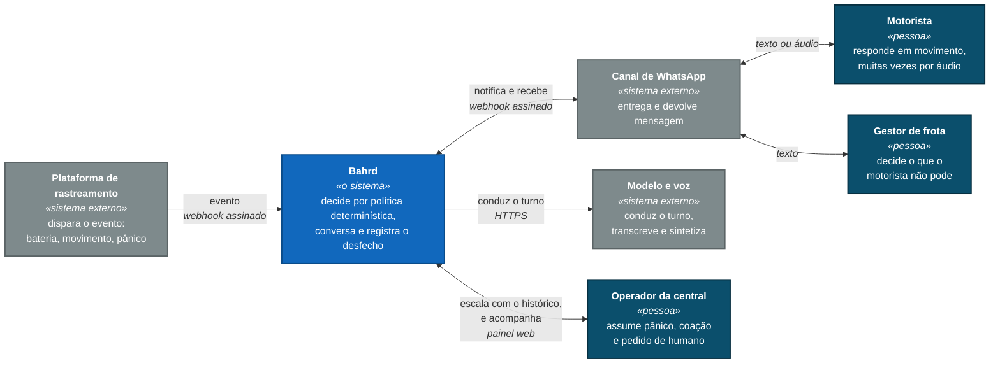

# C4 · Nível 1 — Contexto

Quem usa o sistema, com o que ele conversa, e onde ficam as fronteiras. Uma
caixa só para o Bahrd: **este nível não abre o sistema por dentro** — isso é o
nível 2.

> **Sobre a notação.** O diagrama segue o modelo C4 — pessoa, sistema, sistema
> externo, com as cores do padrão — mas é desenhado como `flowchart` e não com a
> sintaxe `C4Context` do Mermaid. O motivo é prático: aquela sintaxe posiciona as
> caixas numa grade fixa e traça as setas em linha reta, então qualquer relação
> entre caixas não vizinhas cruza o desenho e os rótulos se sobrepõem. Testei, e
> ficou ilegível. C4 é notação, não palavra-chave — o que importa é o modelo, e
> ele está aqui inteiro.

---

## O que o desenho afirma

**Três pessoas, e elas não são intercambiáveis.** O motorista está em movimento
e responde em áudio; o gestor decide o que o motorista não pode; o operador é
quem recebe o que a IA recusa fechar. O sistema fala com os três de formas
diferentes, e confundir isso é o erro mais caro do domínio.

**O evento não nasce aqui.** A plataforma de rastreamento dispara; o Bahrd
reage. Isso torna a assinatura do webhook uma fronteira de confiança, não um
detalhe de implementação.

**O modelo de linguagem está fora da caixa, e conversa só.** Ele não decide
elegibilidade, não consulta banco e não executa ação. A seta que chega nele diz
"pede a condução do turno", e é literal.

**O operador é destino, não usuário eventual.** Toda conversa que a IA não fecha
termina nele, com o histórico inteiro. A seta de volta existe no desenho porque
existe no sistema.

## O que o desenho não mostra

- **Como o sistema é feito por dentro** — nível 2, depois do deploy
- **Quais bancos existem** — idem
- **Onde cada parte roda** — idem

## Fronteiras que importam

| Fronteira | O que atravessa | Consequência |
|---|---|---|
| Plataforma → Bahrd | evento, com placa e localização | Assinatura obrigatória: sem ela, qualquer um forja um evento |
| Bahrd → modelo | contexto da ocorrência | É o único ponto em que dado de cliente sai da fronteira do sistema |
| Bahrd → canal | mensagem ao cliente | Passa por filtro de saída: sem link, com teto de tamanho |

A do meio é a que pesa. É por ela que passa a decisão de pseudonimizar antes do
modelo, registrada como pendência na
[auditoria do protótipo](../auditoria-prototipo.md).

---

> **Nível 2 — Contêiner:** será escrito **depois do deploy**, e deliberadamente.
> Um diagrama de contêiner desenhado antes descreve intenção; desenhado depois,
> descreve o sistema. Como ele existe para ser conferido contra o que está no
> ar, adiantá-lo só criaria uma chance de estar errado.
