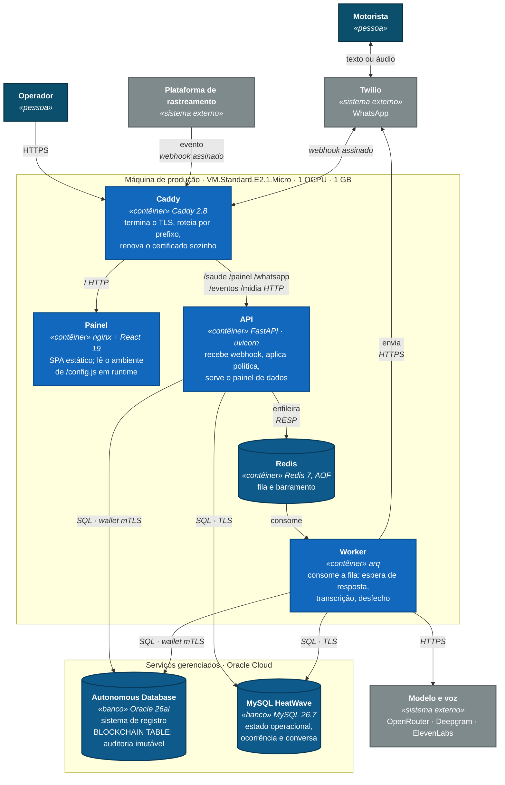

# C4 · Nível 2 — Contêineres

O que o [nível 1](c4-nivel-1-contexto.md) mostrava como uma caixa só, aberto.
Cada caixa aqui é um processo que roda separado, com seu próprio ciclo de vida.

> **Este diagrama foi desenhado depois do deploy, e deliberadamente.** Um
> diagrama de contêiner feito antes descreve intenção; feito depois, descreve o
> sistema. Como ele existe para ser conferido contra o que está no ar, adiantá-lo
> só criaria uma chance de estar errado. O que está abaixo corresponde ao
> [`docker-compose.prod.yml`](../../docker-compose.prod.yml) — se um mudar, o
> outro está errado.

---

## O que o desenho afirma

**A borda é um contêiner, e isso é decisão.** O Caddy existe porque a máquina
não tem *load balancer* na frente — o nível gratuito não inclui um. Ele termina
o TLS, renova o certificado sozinho e roteia por prefixo. Tirá-lo significa
voltar a administrar certbot à mão.

**API e worker são o mesmo código, com comandos diferentes.** A mesma imagem
sobe como `uvicorn` e como `arq`. É por isso que a lacuna de pool importa: são
dois processos pedindo sessão ao mesmo banco, e o teto do nível gratuito é 20 —
daí `ORACLE_POOL_MAX=6`.

**Só o worker fala com o modelo.** A API recebe o webhook e devolve na hora; a
conversa acontece na fila. Um provedor lento não segura a resposta do webhook.

**Os dois bancos não moram na máquina.** Estão do outro lado da fronteira, como
serviço gerenciado. É o que sustenta o argumento do [ADR-002](../adr/0002-plataforma-de-publicacao.md):
o trabalho de operação que pesa — *patching*, backup, ajuste de memória —
continua sendo da Oracle.

**O Redis mora na máquina, e carrega risco.** Ele é fila e barramento, com AOF
ligado, e tem `maxmemory` explícito porque num host de 1 GB um Redis sem teto
derruba a API antes de derrubar a si mesmo.

## O que não cabe em 1 GB

Estes sobem em desenvolvimento e **não** sobem em produção:

| | Em dev | Em produção |
|---|---|---|
| **Jaeger** | recebe OTLP e mostra o rastro | os spans vão para o log estruturado |
| **MinIO** | guarda o áudio | OCI Object Storage, API compatível com S3 |
| **Oracle e MySQL locais** | contêiner | Autonomous Database e HeatWave |

## O estado que ainda está no lugar errado

A API guarda as conversas em curso **na memória do processo**. No desenho acima
isso não aparece — e é exatamente o problema: um estado que não tem caixa é um
estado que ninguém lembra de migrar.

A consequência é direta: **cada deploy reinicia o contêiner `api` e apaga toda
conversa em andamento.** Está registrado como lacuna 3 da
[auditoria](../auditoria-prototipo.md) e é a primeira coisa da fila depois desta
entrega. Quando for resolvida, a seta `API → Redis` passa a carregar também a
sessão, e o desenho muda.

## Fronteiras de confiança

| Fronteira | O que a protege |
|---|---|
| Internet → Caddy | TLS do Let's Encrypt, HSTS, e as duas camadas de firewall (security list da OCI e iptables) |
| Caddy → API | rede interna do Docker; a API não publica porta no host |
| API → Autonomous Database | wallet mTLS, montado só-leitura e nunca embutido na imagem |
| API → MySQL HeatWave | sub-rede privada, sem endereço público, `MYSQL_SSL_MODE=REQUIRED` |
| Worker → modelo | é o único ponto em que dado de cliente sai da fronteira do sistema |
